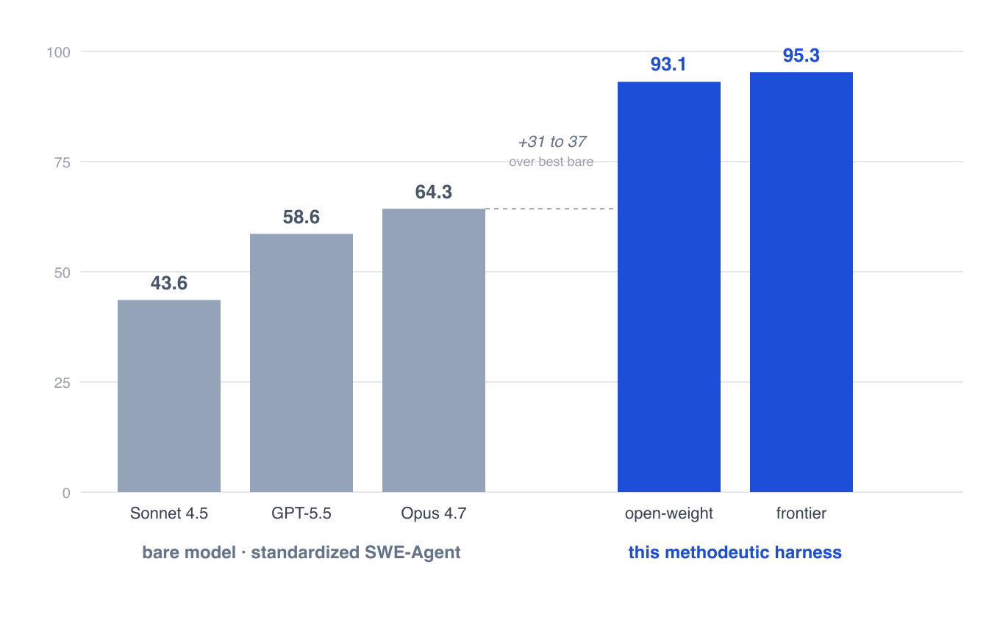
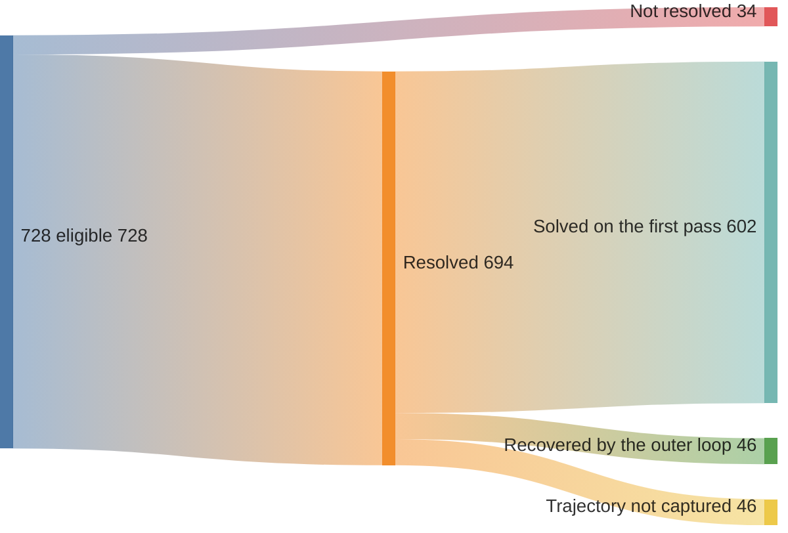
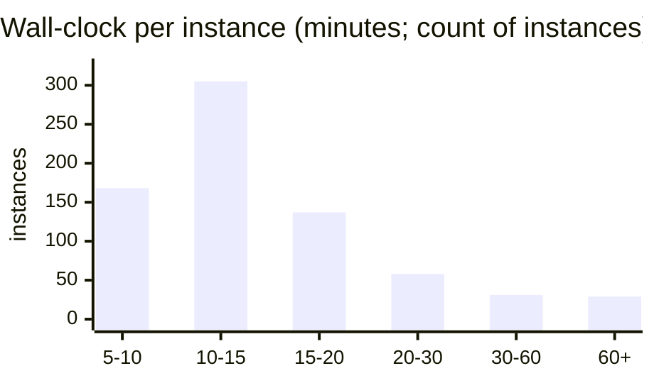
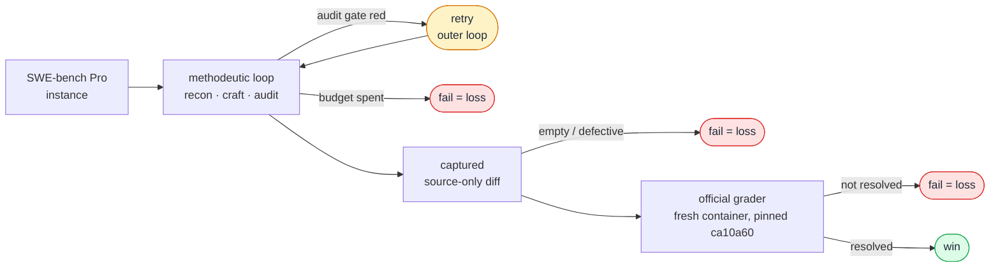

# swebench-pro

This is a program that fixes software bugs on its own. It reads a real bug report from an
open-source project, investigates the codebase, writes a patch, and checks the patch against the
project's own test suite, with no human in the loop.

[SWE-bench Pro](https://labs.scale.com/leaderboard/swe_bench_pro_public) is a benchmark of 728 such
bugs, drawn from real repositories and graded by an official, automated test suite. One person, with a
Claude subscription and a bit of EC2, ran this program across all 728 and resolved **694 of them,
95.3%**, under that official grader on a fresh container, with every losing run committed and any reader
able to reproduce a random sample from one prompt. Solo, unfunded. The number comes with a correction, below: the run used the held-out tests as the gate's stopping signal, so it is an oracle-availability ceiling, not a harness lift.

The number measures what the loop resolves with gate access to the visible tests. Swap the frontier
models for cheap open-weight ones and the same loop still resolves 93.1% (the ablation below), though a
gold-overlap audit shows that cheap-model rate is partly recall, genuinely ~three-quarters
([`docs/OBJECTIONS.md`](docs/OBJECTIONS.md)); so the result is not frontier-specific. The gap over bare
models is a different thing. That gap is oracle access, the gate iterating against tests the bare
scaffold was never handed, and it is no measure of harness skill. See the correction below.

<a id="what-is-methodeutics"></a>The loop is deliberately plain: guess the cause of the bug, write a
fix, run the tests, throw the guess out if they fail, and try again. Three steps run it in order.
**Recon** forms the guess, **craft** writes the fix, **audit** tests and prunes. That guess-first,
test-hard discipline is old enough to have a name, [methodeutics](https://june.kim/reading/methodeutics):
Peirce's term for reasoning by *abduction*, the kind of inference that statistics and mathematics leave
out. The name is optional; the loop is the point. Sibling repo:
[`swebench-verified`](https://github.com/kimjune01/swebench-verified).

## Correction: this run used the tests it should have hidden

We publish our nulls and mistakes in the open, so this one stays on the record with the number it qualifies.

SWE-bench's held-out evaluation rests on one rule: the `FAIL_TO_PASS` tests that decide the grade are withheld from the agent. This public-split run broke it. The gate read the visible `FAIL_TO_PASS` as its stopping signal and iterated the method against the verifier until those tests passed. The repo's own porting note ([`PRO_PORT.md`](docs/PRO_PORT.md)) calls that "the single forbidden move" for held-out evaluation; the run did it anyway, rationalized in [`METHODOLOGY.md`](docs/METHODOLOGY.md) and [`PROCEDURE.md`](docs/PROCEDURE.md) as "legal because the public tests are visible." That rationalization does not hold. Visibility makes the oracle available; it does not turn iterating against it into a measure of the harness.

So 95.3% is an oracle-availability ceiling, not a harness lift. An implement-only loop with no oracle access floors near 50% on the same instances; gate access to the visible tests raises it to about 96%, so roughly 46 of the points are bought by the answer key rather than by harder reasoning. The headline comparison against bare models (95.3% vs 64.3%, below) is confounded the same way: the bare leaderboard scaffold was denied the oracle this harness handed itself.

The error has a name and a writeup. It is a [Type III error](https://en.wikipedia.org/wiki/Type_III_error), a precise answer to the wrong question, worked out in the open in [Precisely Wrong](https://june.kim/type-iii-error). Naming it is what motivated the mechanism experiment, [hygraph-mechanism](https://github.com/kimjune01/hygraph-mechanism), which measures the harness where no visible oracle exists. The honest signal is there and in the OSS deployment below: 81 merged PRs into cold repositories, graded by maintainers, with no test to iterate against. The corrected reading is the paper [*The Hypothesis Graph: Semantic Memory Written by Methodeutics*](https://june.kim/the-hypothesis-graph-semantic-memory-methodeutics). This repository is archived for the record, the mistake included, not as a leaderboard claim.

## The result

<p align="center">
  
</p>

*The gap the chart shows is confounded: the bare-model bars were denied the visible-test oracle this harness iterated against (the correction above).*

The same task, two ways. The same models, run **bare** on the standardized SWE-Agent scaffold, top out at **64.3%** (board-leader Opus 4.7); run through **this harness**, they resolve **95.3%** with a frontier pair and **93.1%** with a cheap open-weight pair, 31 to 37 points higher. That gap is confounded: the bare scaffold was denied the visible-test oracle this loop iterated against, so it measures oracle access, not a harness lift (the correction above). Frontier: 694/728, ~$5.14 and ~12.8 min per instance. Open-weight: 678/728, ~$0.41 and ~8.4 min.

Both pairs run the same frozen harness and the *official* grader on the same *728 eligible* instances, with *zero left ungraded*. Costs are *economic*: every leg priced at publicly posted metered rates (the open-weight generator at its Kimi K2.5 base rate), derived line-by-line in
[`COST_BASIS.md`](docs/COST_BASIS.md); the open-weight-generator pair runs *~12.6× cheaper at 2.2
points lower resolve*.

The anatomy below details the *frontier* run: 694 of 728 resolved, *95.3%*. The
number is honest about its limits:

- The gate iterated against the visible `FAIL_TO_PASS` tests, so 95.3% is an
  oracle-availability ceiling, not a harness lift over bare models (the correction above).
- It is the *public* split, so these repos can sit in a model's training data.
- *93% of wins land on the first pass.* The outer loop is mostly idle and recovers
  a small tail; it is not endless looping to scrape a number.
- *Every verdict is re-gradable* from a committed source-only diff, and you can
  reproduce a *random sample in one prompt* ([below](#reproduce-it-yourself)).

## The harness iterates

One good shot plus a small recovery tail rather than a grind. All 728 eligible instances flow
down to a verdict: 694 resolve, 34 do not, and among the wins with captured trajectories
the first methodeutic pass already carries *93%*, with the outer loop
recovering the rest.



The outer loop earns its keep narrowly: it *converted 46 first-pass misses into wins*,
about 7% of the graded wins, and otherwise stays out of the way. First-pass / recovered
counts are over the 648 wins with captured trajectory data (the other 46 wins predate
trajectory capture). The loss-side anatomy, the per-depth breakdown, and the full-run
flow down to failure modes are in [`RESULTS.md`](docs/RESULTS.md).

## What it costs

The per-instance figures in the table are *economic*: every leg priced at a published
API rate and traced line-by-line from committed token totals, so a third party can
reproduce them. The frontier pair runs *~$5.14*; the open-weight-generator pair does the same
work for *~$0.41*. The operator's actual cash was far lower, most of it absorbed by
flat subscriptions (Claude Max, codex, Cursor) at roughly zero marginal cost. The full
arithmetic for both pairs, plus the cash-vs-economic reconciliation, is in
[`COST_BASIS.md`](docs/COST_BASIS.md).

## How fast it runs

Median *~13 min* per instance; 84% finish inside 5 to 20 minutes. The right tail is
heavy repos and craft-hangs on large suites, well outside the typical case.



The *~13 min* is per instance. The full 728-set took *~3.5 days* of wall-clock
end-to-end, bounded by fleet size (4 to 8 boxes) and three auth stalls, not by
per-instance speed. The run is embarrassingly parallel
([`SCOREBOARD.md`](docs/SCOREBOARD.md), [`RUN_NOTES.md`](docs/RUN_NOTES.md)).

## How a verdict is made

The agent's own opinion never counts. Its internal gate is only a stopping signal; the
verdict is always the *official* grade of the captured source-only diff, run on a
*fresh container* with the grader pinned at commit `ca10a60`.



Every *fail* branch is what we count as a loss: all 34 are real graded `not resolved`
on *non-empty* patches, with no empty captures padding the wins. The harness can think
it passed (its audit gate green) and still be graded a loss; the grade is the diff's
alone. Full loss breakdown in [`RESULTS.md`](docs/RESULTS.md); the pipeline is in
[`METHODOLOGY.md`](docs/METHODOLOGY.md).

## Reproduce it yourself

Don't take the number on faith, and you don't need to rerun 728 instances or stand up
a cloud fleet. Pick a *random* sample, run the harness on *your* picks, grade with the
*official* grader; most instances run on your laptop under Docker/OrbStack (no EC2
unless a heavy repo is drawn), so a 20-instance check is an evening of subscription
tokens. Paste this to *any coding-grade agent*: codex, Claude Code, Cursor,
Gemini CLI, whatever you run. The open-weight ablation shows the harness isn't
model-picky, so the repro steps don't depend on a particular vendor or tier:

> I'm skeptical of the SWE-bench Pro result in github.com/kimjune01/swebench-pro
> (claimed 95.3% resolved). First, inspect `driver/bootstrap.sh` and the pipeline it
> invokes, and confirm it only pulls the pinned official eval repo, runs the grader in
> Docker, and uses my credentials locally; tell me what it does before running it.
> Then, following `CLAUDE.md`/`docs/PROCEDURE.md`, run the *harness-under-test* on a
> *random* ~20-instance sample from `runs/audit/eligible.txt` (print your seed and
> ids), grade each with the *unmodified official* grader, and report resolved / 20
> with a confidence interval and whether it's consistent with 95.3%. Use my own
> machine and tokens. If you hit a snag, the repo's docs have the fix.

Goal-first on purpose: it points at the destination instead of a recipe; a snag is a one-line
followup, never a blocker.

Free, no-token variant: re-grade our *committed* diffs instead. Every verdict's captured
source-only diff is in `runs/scored/artifacts.tar.zst`; re-grading a random handful on
fresh containers confirms the *recorded* verdicts are real. The prompt above is the
stronger check: it confirms the harness reproduces the *rate* on instances you choose.

Doubts beyond the headline (did it game the grader, are the losses real, is the cost honest, is it just the strong model) each have a paste-ready verification prompt in
[`FOR_SKEPTICS.md`](docs/FOR_SKEPTICS.md). Point your agent in.

## Will this hold on the private set?

Expect a substantial drop. The private split withholds the `FAIL_TO_PASS` tests this
gate leaned on, so the gate goes blind and the number should fall toward its oracle-free
floor: the ~50% bracket an implement-only loop hits, or the ~three-quarters rate the OSS
deployment shows where maintainers grade. Predicting that drop in print is part of the
discipline. The contamination-free OSS check below is the honest signal for what survives;
four secondary risks could pull a private number down further, in roughly descending order
of concern:

- **Contamination.** Public repos can be in training data; the private split is held
  out for exactly this reason. Contamination bounds the *absolute capability*
  reading, though not the harness-vs-harness delta on a fixed model.
- **Repo familiarity.** The loop benefits from public repos the model has likely seen;
  unfamiliar private code is the real test.
- **Same-family tuning.** The harness was developed on `swebench-verified` and adapted
  once for Pro; it has never touched the private split, but it shares a lineage with it.
- **Distribution shift.** Different repos, possibly a blind submission gate, and task
  shapes the loop hasn't been exercised on.

*A contamination-free check already exists.* Over a *~10-day* run the same
methodeutic loop shipped *81 merged PRs into 73 cold repos*, codebases it
didn't own and held no training priors for: fresh, post-cutoff issues, accepted by real
maintainers at a *~50% merge rate* (81 of 160 decided). That rate is a *floor* on
correctness, not an estimate of it: a close-reason audit found only ~8 of the 79 closures
were rejections on the merits; the rest were no-AI policies, AI discrimination, author
withdrawals, and duplicates, none of which mean the fix was wrong, so the share of
*correct* solutions runs well above 50%. The ledger is committed
([`pr-receipts.jsonl`](docs/pr-receipts.jsonl)) and verifiable two ways: recompute from the
file or rerun the live GraphQL ([`pr-receipts.VERIFY.md`](docs/pr-receipts.VERIFY.md)); the
OSS program's [hypothesis graph](docs/OSS_HYPOTHESIS_GRAPH.md) has the per-failure-mode
breakdown. That tests the repo-familiarity and
distribution-shift worries head-on, where training-data overlap can't help: a maintainer
merges the fix or closes it. These came from the sibling
[`sweep`](https://github.com/kimjune01/sweep) pipeline, the same methodeutics lineage
rather than a byte-for-byte transplant of this harness, so read it as evidence for the
method, with the open-weight ablation above as the evidence for *this* scaffold.

It was never a leaderboard bid, either. That board ranks *models* through a standard
harness; a *harness* measurement can't sit on it by construction, and Composer 2.5, the
open-weight model in the ablation, is Cursor's own and has no spot there. If Cursor can't
get a seat, a solo's scaffold number never will; that's by intent.

This is why the public number is framed as an audition, short of a deliverable. The strategy
for the held-out set is in [`PREREGISTRATION.md`](docs/PREREGISTRATION.md) §0 to §1.

## What the score actually measures

The score measures resolution with gate access to the visible tests, not harness skill over
bare models (the correction above). What the open-weight ablation pins down is narrower: the
result is not frontier-model-specific, given that oracle. Swap the frontier pair for cheap
open-weight models and the same frozen harness still resolves *93.1%*, a 2.2-point raw dip; a
gold-overlap audit ([`docs/OBJECTIONS.md`](docs/OBJECTIONS.md), [`driver/gold_divergence.py`](driver/gold_divergence.py)) shows ~18–23% of those open-weight wins reproduce the gold patch (against ~2% for the frontier pair), so the cheap-model rate is partly recall and the genuine model-tier gap is ~17–22 points, not two. Discount the recall tail and the harness still carries the cheap model to ~three-quarters genuine resolve. The system here is a Sonnet-4.5 generator plus a GPT-5.5 craft challenger, both
contaminated on these repos, with the strict scaffold-vs-model control deliberately
unclosed. The defensible reading is "the methodeutic harness resolved 694/728 under official
grading with gate access to the visible tests," not "the model can solve 95% of SWE-bench
Pro." What the system is and why the confound stays open:
[`METHODOLOGY.md`](docs/METHODOLOGY.md) and [`PREREGISTRATION.md`](docs/PREREGISTRATION.md) §7/§12.

Provenance in brief: 728 = 731 dataset instances minus 3 whose own gold patch fails the
official grader (a pre-run defect audit, frozen before the scored run). Every figure
recomputes from `runs/scored/run.jsonl`; every verdict re-grades from its captured
source-only diff in `runs/scored/artifacts.tar.zst` (87 MB, 6,553 files; sha256 +
listing in `runs/scored/artifacts.MANIFEST.txt`). The run was *not uninterrupted*:
provider-credential (auth) stalls, token-quota stoppages, the occasional box crash (heavy
images exhausting disk), and a mid-run switch from Max-subscription to paid API billing.
None of these count as losses: the recovery discipline re-dispatches only instances that
captured a **0-byte patch** (no submission ever happened), while any *non-empty* patch
graded `not resolved` stays a LOSS mechanically. So infrastructure failure is discounted
from the score by construction, not by judgment: the 34 losses are genuine graded
outcomes, and all stalls recovered with 0 instances lost
([`RUN_NOTES.md`](docs/RUN_NOTES.md), [`PREREGISTRATION.md`](docs/PREREGISTRATION.md) §14).

The whole campaign is on the record decision-by-decision: an append-only
[`WORKLOG.md`](docs/WORKLOG.md) timestamps every choice, dead end, and losing run as it
happened: a lab notebook left open, not a tidied-up writeup. That's still rare for a
benchmark result, and it's the point: the trail that produced the number is as auditable
as the number.

## Where to go next

| If you want to… | Read |
|---|---|
| Read the narrative essay (the *why*, not the *how*) | [The Hypothesis Graph: Semantic Memory Written by Methodeutics](https://june.kim/the-hypothesis-graph-semantic-memory-methodeutics) · [Precisely Wrong](https://june.kim/type-iii-error) (the oracle-access error) |
| Scan result · cost · speed with charts | [`SCOREBOARD.md`](docs/SCOREBOARD.md) |
| Audit the numbers and read the loss analysis | [`RESULTS.md`](docs/RESULTS.md) |
| Trace the per-instance cost arithmetic | [`COST_BASIS.md`](docs/COST_BASIS.md) |
| Read the economic argument (job-shop unit cost) | [`DISCUSSION.md`](docs/DISCUSSION.md) |
| Weigh the result against the obvious objections | [`OBJECTIONS.md`](docs/OBJECTIONS.md) |
| Check a doubt yourself (paste-ready prompts) | [`FOR_SKEPTICS.md`](docs/FOR_SKEPTICS.md) |
| Check the contamination-free OSS receipts | [`pr-receipts.VERIFY.md`](docs/pr-receipts.VERIFY.md) |
| Understand how the number was produced | [`METHODOLOGY.md`](docs/METHODOLOGY.md) |
| See how the harness ported from Verified to Pro | [`PRO_PORT.md`](docs/PRO_PORT.md) |
| Check the rules the run was held to | [`PREREGISTRATION.md`](docs/PREREGISTRATION.md) |
| Read the open-weight ablation's pre-registration | [`PREREGISTRATION-cheap-ablation.md`](docs/PREREGISTRATION-cheap-ablation.md) |
| Audit the run's provenance (stalls, cost, load) | [`RUN_NOTES.md`](docs/RUN_NOTES.md) |
| Reproduce a result from scratch | [`PROCEDURE.md`](docs/PROCEDURE.md) |
| Read the chronological trail | [`WORKLOG.md`](docs/WORKLOG.md) |

## The fine print

**Methodeutics** ([defined up top](#what-is-methodeutics)) covers the third inference
statistics and mathematics don't own: abduction. In this harness recon abduces, craft
acts, audit tests; the theoretical leg is the textbook at
[june.kim/reading/methodeutics](https://june.kim/reading/methodeutics).

*Why should a guy with a blog and spare change out-score trillion-dollar labs?* He
doesn't, on the axis they compete on: their leaderboards rank *models* through a fixed
harness; this ranks a *harness*. The fuller argument is in [`DISCUSSION.md`](docs/DISCUSSION.md).

**The goal this run auditioned for:** a single frozen, instance-agnostic artifact that
clears SWE-bench Pro under official third-party grading on the held-out private set, in
one submission, verifiably free of per-instance priors. The public 95.3% is the
audition; the deliverable is the artifact plus its reproducible attestation trail
([`PREREGISTRATION.md`](docs/PREREGISTRATION.md) §0 to §1).

**The benchmark is not mine.** SWE-bench Pro, its repositories, and its official grader are the work of Deng et al. (Scale AI), 2025: [paper](https://arxiv.org/abs/2509.16941) · [leaderboard](https://labs.scale.com/leaderboard/swe_bench_pro_public) · [dataset](https://huggingface.co/datasets/ScaleAI/SWE-bench_Pro) · [code](https://github.com/scaleapi/SWE-bench_Pro-os). This repository only evaluates a harness on their public split. Cite the benchmark as:

```bibtex
@misc{deng2025swebenchpro,
  title  = {{SWE-Bench Pro}: Can AI Agents Solve Long-Horizon Software Engineering Tasks?},
  author = {Deng, Xiang and Da, Jeff and Pan, Edwin and He, Yannis Yiming and Ide, Charles and Garg, Kanak and Lauffer, Niklas and Park, Andrew and Pasari, Nitin and Rane, Chetan and Sampath, Karmini and Krishnan, Maya and Kundurthy, Srivatsa and Hendryx, Sean and Wang, Zifan and Bharadwaj, Vijay and Holm, Jeff and Aluri, Raja and Zhang, Chen Bo Calvin and Jacobson, Noah and Liu, Bing and Kenstler, Brad},
  year   = {2025},
  eprint = {2509.16941},
  archivePrefix = {arXiv},
  primaryClass  = {cs.SE},
  doi    = {10.48550/arXiv.2509.16941}
}
```

**Funding:** this research was entirely funded by the researcher, June Kim
([LinkedIn](https://www.linkedin.com/in/kimjune01) · [ORCID 0009-0005-3153-9396](https://orcid.org/0009-0005-3153-9396)): own EC2 and Claude Max subscription,
no external or institutional funding ([`RUN_NOTES.md`](docs/RUN_NOTES.md)).

**License:** repo CC BY-SA-NS ([`LICENSE.md`](LICENSE.md)); skills (`skills/`)
dual-licensed CC BY-SA-NS *or* GPL-3.0, recipient's choice
([`skills/LICENSE.md`](skills/LICENSE.md)).
