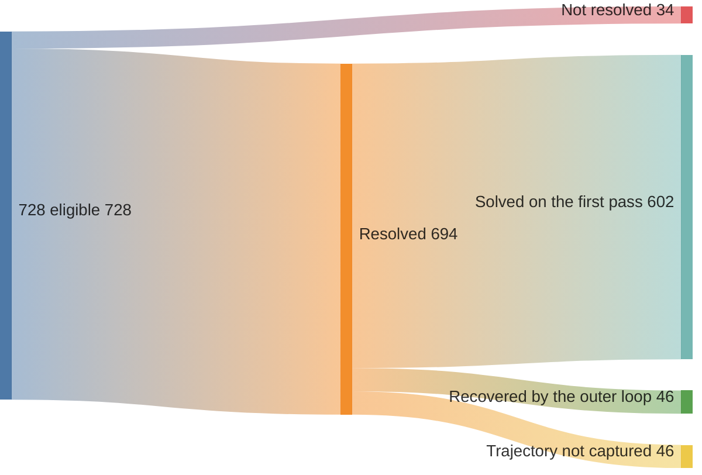
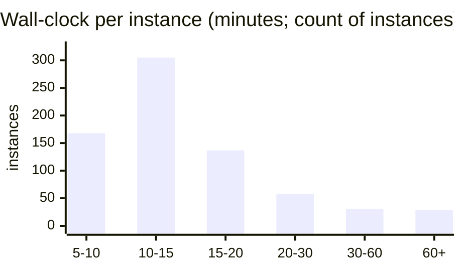

# swebench-pro

[](https://doi.org/10.5281/zenodo.20691977)

This is a benchmark harness: an automated loop that attempts software-bug fixes on SWE-bench Pro
instances, with the gate iterating against the benchmark's visible tests. Humans designed the loop
and handled stalls; for each dispatched instance, no human edits the patch during the attempt. The
loop reads a benchmark bug report drawn from a real open-source repository, investigates the
codebase, writes a patch, and checks it against the project's own test suite.

[SWE-bench Pro](https://labs.scale.com/leaderboard/swe_bench_pro_public) is a benchmark of 728
such instances, drawn from real repositories and graded by an official, automated
test suite. One person, with a Claude subscription and a bit of EC2, ran this harness across all 728
and resolved **694 of them, 95.3%** (an oracle-availability figure: the gate used the visible
`FAIL_TO_PASS` tests as its stopping signal), re-graded by the official grader on a fresh container,
with the graded losing source diffs and run records committed and a prompt readers can use to
reproduce a random sample. The run was performed by one researcher on personal compute and
subscriptions, no external funding. The number comes with a correction, below: the run used the
held-out tests as the gate's stopping signal, so it is an oracle-availability ceiling, not a harness lift.

The number measures what this loop resolved on the public split while using the visible `FAIL_TO_PASS`
tests as the gate's stopping signal. Swap the frontier models for cheap open-weight ones and the same
loop reached 93.1% under the same visible-test-gated setup (the ablation below), though a
gold-overlap audit shows that cheap-model rate is partly recall, genuinely ~three-quarters
([`docs/OBJECTIONS.md`](docs/OBJECTIONS.md)); so the result is not solely a frontier-model result,
the open-weight number partly explained by gold-patch recall. The gap over bare
models is a different thing. That gap is oracle access, the gate iterating against tests the bare
scaffold was never handed, and it is no measure of harness skill. See the correction below.

<a id="what-is-methodeutics"></a>The loop is conceptually simple: form a hypothesis about the cause of
the bug, write a fix, run the tests, throw the guess out if they fail, and try again. Three steps run it
in order. **Recon** forms the guess, **craft** writes the fix, **audit** tests and prunes. That
guess-first, test-hard discipline has a name, [methodeutics](https://june.kim/reading/methodeutics):
a label for hypothesis-first, test-gated abductive reasoning, Peirce's term for *abduction*. The term
is used here as that label; the loop is the point. Sibling repo:
[`swebench-verified`](https://github.com/kimjune01/swebench-verified).

## Correction: this run used the tests it should have hidden

We publish our nulls and mistakes in the open, so this one stays on the record with the number it qualifies.

SWE-bench's held-out evaluation rests on one rule: the `FAIL_TO_PASS` tests that decide the grade are withheld from the agent. This public-split run broke it. The gate read the visible `FAIL_TO_PASS` as its stopping signal and iterated the method against the verifier until those tests passed. The repo's own porting note ([`PRO_PORT.md`](docs/PRO_PORT.md)) calls that "the single forbidden move" for held-out evaluation; the run did it anyway, rationalized in [`METHODOLOGY.md`](docs/METHODOLOGY.md) and [`PROCEDURE.md`](docs/PROCEDURE.md) as "legal because the public tests are visible." That rationalization does not hold. Visibility makes the oracle available; it does not turn iterating against it into a measure of the harness.

So 95.3% is an oracle-availability ceiling, not a harness lift. An implement-only loop with no oracle access floors near 50% on the same instances; gate access to the visible tests raises it to about 96%, so roughly 46 of the points are bought by the answer key rather than by harder reasoning. The headline comparison against bare models (95.3% vs 64.3%, below) is confounded the same way: the bare leaderboard scaffold was denied the oracle this harness handed itself.

The error has a name and a writeup. It is a [Type III error](https://en.wikipedia.org/wiki/Type_III_error), a precise answer to the wrong question, worked out in the open in [Precisely Wrong](https://june.kim/type-iii-error). Naming it is what motivated the mechanism experiment, [hygraph-mechanism](https://github.com/kimjune01/hygraph-mechanism), which measures the harness where no visible oracle exists. The honest signal is there and in the OSS deployment below: 81 merged PRs into cold repositories, graded by maintainers, with no test to iterate against. The corrected reading is the paper [*The Hypothesis Graph: Semantic Memory Written by Methodeutics*](https://june.kim/the-hypothesis-graph-semantic-memory-methodeutics). This repository is archived for the record, the mistake included, not as a leaderboard claim.

## The result

<p align="center">
  
</p>

*The gap the chart shows is confounded: the bare-model bars were denied the visible-test oracle this harness iterated against (the correction above).*

Not the same task: one path has visible-test oracle access and the bare scaffold does not. Comparable model choices, run **bare** on the standardized SWE-Agent scaffold, reach **64.3%** (board-leader Opus 4.7); run through **this harness**, they resolve **95.3%** with a frontier pair and **93.1%** with a cheap open-weight pair, numerically 31 to 37 points higher but not interpretable as a harness lift because oracle access differs. That gap is confounded: the bare scaffold was denied the visible-test oracle this loop iterated against, so it measures oracle access, not a harness lift (the correction above). Frontier: 694/728, ~$5.14 and ~12.8 min per instance. Open-weight: 678/728, ~$0.41 and ~8.4 min.

Both pairs used the same harness version for the reported runs and the *official* grader on the same *728 eligible* instances, with final recorded grades for all 728. Costs are *economic*: every leg priced at publicly posted metered rates (the open-weight generator at its Kimi K2.5 base rate), derived line-by-line in
[`COST_BASIS.md`](docs/COST_BASIS.md); the open-weight-generator pair runs *~12.6× cheaper at 2.2
points lower resolve*.

The anatomy below details the *frontier* run: 694 of 728 resolved, *95.3%*. The
number has these limits:

- The gate iterated against the visible `FAIL_TO_PASS` tests, so 95.3% is an
  oracle-availability ceiling, not a harness lift over bare models (the correction above).
- It is the *public* split, so these repos can sit in a model's training data.
- Among wins with captured trajectories, about *93% landed on the first pass.* The outer
  loop is mostly idle and recovers a small tail relative to first-pass wins.
- *Every verdict is re-gradable* from a committed source-only diff, and you can
  reproduce a *random sample in one prompt* ([below](#reproduce-it-yourself)).

## The harness iterates

Most captured wins occurred on the first pass, with a smaller recovery tail. All 728 eligible
instances have recorded final verdicts: 694 resolve, 34 do not, and among the 648 wins with
captured trajectory data the first pass accounts for about *93%*, with the outer loop
recovering the rest.



The outer loop accounts for 46 recovered wins in the captured-trajectory subset, about 7% of
the graded wins, and its recorded recovery contribution is limited to that tail. First-pass / recovered
counts are over the 648 wins with captured trajectory data (the other 46 wins predate
trajectory capture). The loss-side anatomy, the per-depth breakdown, and the full-run
flow down to failure modes are in [`RESULTS.md`](docs/RESULTS.md).

## What it costs

The per-instance figures in the table are modeled *economic* costs: every leg priced at a published
API rate and traced line-by-line from committed token totals, so a third party can
recompute the reported arithmetic. The frontier pair runs *~$5.14*; the open-weight-generator pair
runs the same harness configuration for *~$0.41*. The operator's actual cash was far lower, most of it
absorbed by flat subscriptions (Claude Max, codex, Cursor) at near-zero marginal cash cost under those
subscriptions at the time of the run. The full
arithmetic for both pairs, plus the cash-vs-economic reconciliation, is in
[`COST_BASIS.md`](docs/COST_BASIS.md).

## How fast it runs

In this run, median *~13 min* per instance under the operator's setup; 84% finished inside 5 to 20
minutes. The right tail is heavy repos and craft-hangs on large suites, outside the 5-to-20-minute
band that covered 84% of instances.



The *~13 min* is per instance. The full 728-set took *~3.5 days* of wall-clock
end-to-end, bounded by fleet size (4 to 8 boxes) and three auth stalls, not by
per-instance speed. The instances are largely parallelizable, subject to fleet size, credentials,
provider limits, and heavy-repo resource needs
([`SCOREBOARD.md`](docs/SCOREBOARD.md), [`RUN_NOTES.md`](docs/RUN_NOTES.md)).

## How a verdict is made

The final reported verdict does not use the agent's self-assessment. Its internal gate is only a
stopping signal; for recorded final verdicts the reported outcome is the *official* grade of the
captured source-only diff, run on a *fresh container* with the grader pinned at commit `ca10a60`.


Each final *fail* branch in this pipeline is counted as a loss: all 34 final losses are graded
`not resolved` on *non-empty* patches, with 0-byte captures not counted as wins. The harness can think
it passed (its audit gate green) and still be graded a loss; the grade is determined by running the
captured diff through the pinned grader environment. Full loss breakdown in [`RESULTS.md`](docs/RESULTS.md); the pipeline is in
[`METHODOLOGY.md`](docs/METHODOLOGY.md).

## Reproduce it yourself

A spot-check doesn't require rerunning all 728 instances or necessarily standing up
a cloud fleet. Pick a *random* sample and run the harness on *your* picks to check whether
the sample is consistent with the reported rate, grading with the *official* grader; many
instances may run locally under Docker/OrbStack (no EC2 unless a heavy repo is drawn),
depending on the sampled repos and machine, so a 20-instance check may be feasible with
local compute and available model credits. Paste this to a coding agent capable of shell
use, Docker, and repository inspection: codex, Claude Code, Cursor, Gemini CLI, or a
comparable agent with the needed local permissions. The reported ablation suggests the
harness is not limited to the frontier pair under this oracle-gated setup, so the repro
workflow is not written for one specific vendor, though model and agent quality may affect outcomes:

> I'm skeptical of the SWE-bench Pro result in github.com/kimjune01/swebench-pro
> (claimed 95.3% resolved). First, inspect `driver/bootstrap.sh` and the pipeline it
> invokes, and confirm it only pulls the pinned official eval repo, runs the grader in
> Docker, and uses my credentials locally; tell me what it does before running it.
> Then, following `CLAUDE.md`/`docs/PROCEDURE.md`, run the *harness-under-test* on a
> *random* ~20-instance sample from `runs/audit/eligible.txt` (print your seed and
> ids), grade each with the *unmodified official* grader, and report resolved / 20
> with a confidence interval and whether it's consistent with 95.3%. Use my own
> machine and tokens. If you hit a snag, the repo's docs have the fix.

Goal-first on purpose: it points at the destination instead of a recipe; some common snags are
documented for follow-up.

No-model-token variant: re-grade our *committed* diffs instead. Every verdict's captured
source-only diff is in `runs/scored/artifacts.tar.zst`; re-grading a random handful on
fresh containers checks whether sampled recorded verdicts reproduce under the pinned grading path.
The prompt above is the stronger check: it tests whether a fresh random sample is statistically
consistent with the reported *rate* on instances you choose.

Other audit questions (did it game the grader, are the losses real, is the cost honest, is it just the strong model) each have a paste-ready verification prompt in
[`FOR_SKEPTICS.md`](docs/FOR_SKEPTICS.md). Point your agent in.

## Will this hold on the private set?

I expect a substantial drop; this has not been measured on the private set. The private split
withholds the `FAIL_TO_PASS` tests this gate leaned on, so the gate goes blind and the number may
fall toward the oracle-free estimates observed in related setups: the roughly 50% bracket observed
for an implement-only loop on these instances, or the roughly three-quarters genuine-resolve estimate
inferred from the separate OSS deployment, which uses maintainer outcomes rather than benchmark
grading. Predicting that drop in print is part of the discipline. The OSS check below is a
less oracle-exposed signal about what may survive; four additional risks could pull a private number
down further, in roughly descending order of concern:

- **Contamination.** Public repos can be in training data; the private split is held
  out for exactly this reason. Contamination limits the *absolute capability*
  reading, though not the harness-vs-harness delta on a fixed model.
- **Repo familiarity.** The loop benefits from public repos the model has likely seen;
  unfamiliar private code is the evaluation condition this public run does not cover.
- **Same-family tuning.** The harness was developed on `swebench-verified` and adapted
  once for Pro; it has never touched the private split, but it shares a lineage with it.
- **Distribution shift.** Different repos, possibly a blind submission gate, and task
  shapes the loop hasn't been exercised on.

*A less benchmark-contaminated OSS check is also reported.* Over a *~10-day* run a related
methodeutic loop from the sibling pipeline shipped *81 merged PRs into 73 repositories not owned
by the operator*, where no per-repository priors were intentionally supplied: issues described as
fresh and post-cutoff for the models used, accepted by repository maintainers at a *~50% merge rate*
(81 of 160 decided). That merge rate is a conservative proxy for accepted fixes, not a direct
correctness estimate: a close-reason audit found only ~8 of the 79 closures were rejections on the
merits; the rest were no-AI policies, AI discrimination, author withdrawals, and duplicates, many of
which do not by themselves establish that the fix was wrong, so the true correctness rate may be above
the raw 50% merge rate, though the exact rate is not directly measured. The ledger is committed
([`pr-receipts.jsonl`](docs/pr-receipts.jsonl)) and auditable two ways: recompute from the
file, or rerun the live GraphQL subject to GitHub/API availability ([`pr-receipts.VERIFY.md`](docs/pr-receipts.VERIFY.md)); the
OSS program's [hypothesis graph](docs/OSS_HYPOTHESIS_GRAPH.md) has the per-failure-mode
breakdown. That provides related evidence against the repo-familiarity and
distribution-shift worries, on a different task distribution where benchmark answer-key overlap
should not help in the same way: a maintainer either accepts, closes, or otherwise responds to the PR.
These came from the sibling [`sweep`](https://github.com/kimjune01/sweep) pipeline, the same
methodeutics lineage rather than a byte-for-byte transplant of this harness, so read it as supporting
evidence for the broader method family, with the open-weight ablation above as the evidence about
*this* scaffold under the public-split, visible-test-gated setup.

This result should not be read as a leaderboard submission, either. That board ranks *models* through
a standard harness; a *harness* measurement can't sit on it by construction, and Composer 2.5, the
open-weight model in the ablation, is Cursor's own and has no spot there. Because the board ranks
models under a standard harness, this harness result does not map directly onto a leaderboard slot;
that's by intent.

This is why the public number is preliminary evidence for a future held-out artifact submission,
not the deliverable itself. The strategy for the held-out set is in
[`PREREGISTRATION.md`](docs/PREREGISTRATION.md) §0 to §1.

## What the score actually measures

The score measures resolution with gate access to the visible tests, not harness skill over
bare models (the correction above). What the open-weight ablation suggests is narrower: the
public-split oracle-gated result is not limited to the reported frontier pair. Swap the frontier pair
for cheap open-weight models and the same harness version resolved *93.1%* on the public split with the
same visible-test gate, a 2.2-point raw dip; a gold-overlap audit ([`docs/OBJECTIONS.md`](docs/OBJECTIONS.md), [`driver/gold_divergence.py`](driver/gold_divergence.py)) shows ~18–23% of those open-weight wins reproduce the gold patch (against ~2% for the frontier pair), so the cheap-model rate is partly recall and the estimated model-tier gap after discounting apparent gold recall is ~17–22 points, not two. Discount the recall tail and the discounted estimate is roughly three-quarters resolve for the cheap-model setup under the same oracle-gated conditions. The system here is a Sonnet-4.5 generator plus a GPT-5.5 craft challenger, both
exposed to possible public-repo training contamination, with the run not closing the scaffold-versus-model
control. The narrow reading is "the methodeutic harness resolved 694/728 public-split eligible instances
under official grading while using visible `FAIL_TO_PASS` tests as its gate," not "the model can solve
95% of SWE-bench Pro." What the system is and why the confound stays open:
[`METHODOLOGY.md`](docs/METHODOLOGY.md) and [`PREREGISTRATION.md`](docs/PREREGISTRATION.md) §7/§12.

Provenance in brief: 728 = 731 dataset instances minus 3 whose own gold patch fails the
official grader (a pre-run defect audit, frozen before the scored run). Every figure
recomputes from `runs/scored/run.jsonl`; every verdict re-grades from its captured
source-only diff in `runs/scored/artifacts.tar.zst` (87 MB, 6,553 files; sha256 +
listing in `runs/scored/artifacts.MANIFEST.txt`). The run was *not uninterrupted*:
provider-credential (auth) stalls, token-quota stoppages, the occasional box crash (heavy
images exhausting disk), and a mid-run switch from Max-subscription to paid API billing.
None of these count as losses: the recovery discipline re-dispatches only instances that
captured a **0-byte patch** (no submission ever happened), while any *non-empty* patch
graded `not resolved` stays a LOSS mechanically. So infrastructure failure is discounted
from the score by construction, not by judgment: the 34 losses are non-empty patches graded
`not resolved`, and all stalls were eventually re-dispatched so that no eligible instance lacked a
final recorded verdict ([`RUN_NOTES.md`](docs/RUN_NOTES.md), [`PREREGISTRATION.md`](docs/PREREGISTRATION.md) §14).

The campaign includes an append-only [`WORKLOG.md`](docs/WORKLOG.md) that timestamps the recorded
choices, dead ends, and losing runs as they happened: a lab notebook left open, not a tidied-up
writeup. That provenance is part of the intended audit trail: the trail that produced the number is
meant to be auditable, not just the final metric.

## Where to go next

| If you want to… | Read |
|---|---|
| Read the narrative essay (the *why*, not the *how*) | [The Hypothesis Graph: Semantic Memory Written by Methodeutics](https://june.kim/the-hypothesis-graph-semantic-memory-methodeutics) · [Precisely Wrong](https://june.kim/type-iii-error) (the oracle-access error) |
| Scan result · cost · speed with charts | [`SCOREBOARD.md`](docs/SCOREBOARD.md) |
| Audit the numbers and read the loss analysis | [`RESULTS.md`](docs/RESULTS.md) |
| Trace the per-instance cost arithmetic | [`COST_BASIS.md`](docs/COST_BASIS.md) |
| Read the economic argument (job-shop unit cost) | [`DISCUSSION.md`](docs/DISCUSSION.md) |
| Read the objections and limitations | [`OBJECTIONS.md`](docs/OBJECTIONS.md) |
| Check a doubt yourself (paste-ready prompts) | [`FOR_SKEPTICS.md`](docs/FOR_SKEPTICS.md) |
| Check the OSS PR receipts | [`pr-receipts.VERIFY.md`](docs/pr-receipts.VERIFY.md) |
| Understand how the number was produced | [`METHODOLOGY.md`](docs/METHODOLOGY.md) |
| See how the harness ported from Verified to Pro | [`PRO_PORT.md`](docs/PRO_PORT.md) |
| Check the rules the run was held to | [`PREREGISTRATION.md`](docs/PREREGISTRATION.md) |
| Read the open-weight ablation's pre-registration | [`PREREGISTRATION-cheap-ablation.md`](docs/PREREGISTRATION-cheap-ablation.md) |
| Audit the run's provenance (stalls, cost, load) | [`RUN_NOTES.md`](docs/RUN_NOTES.md) |
| Attempt a fresh sample reproduction | [`PROCEDURE.md`](docs/PROCEDURE.md) |
| Read the chronological trail | [`WORKLOG.md`](docs/WORKLOG.md) |

## The fine print

**Methodeutics** ([defined up top](#what-is-methodeutics)) is used here as a label for
abduction-centered reasoning: hypothesis formation followed by action and test. In this harness recon
abduces, craft acts, audit tests; the theoretical leg is the textbook at
[june.kim/reading/methodeutics](https://june.kim/reading/methodeutics).

*Why compare a harness result to model leaderboard numbers?* It does not out-score labs on the
model-leaderboard axis: their leaderboards rank *models* through a fixed harness; this ranks a
*harness*. The fuller argument is in [`DISCUSSION.md`](docs/DISCUSSION.md).

**The intended next target for this line of work:** a single frozen, instance-agnostic artifact
submitted to SWE-bench Pro private evaluation under official third-party grading, in one submission,
with documented controls intended to exclude per-instance priors. The public 95.3% is preliminary,
oracle-gated evidence, not the held-out deliverable, which is the artifact plus its reproducible
attestation trail ([`PREREGISTRATION.md`](docs/PREREGISTRATION.md) §0 to §1).

**The benchmark is not mine.** SWE-bench Pro, its repositories, and its official grader are the work of Deng et al. (Scale AI), 2025: [paper](https://arxiv.org/abs/2509.16941) · [leaderboard](https://labs.scale.com/leaderboard/swe_bench_pro_public) · [dataset](https://huggingface.co/datasets/ScaleAI/SWE-bench_Pro) · [code](https://github.com/scaleapi/SWE-bench_Pro-os). This repository evaluates a harness on their public split, including the visible-test gate limitation described above. Cite the benchmark as:

```bibtex
@misc{deng2025swebenchpro,
  title  = {{SWE-Bench Pro}: Can AI Agents Solve Long-Horizon Software Engineering Tasks?},
  author = {Deng, Xiang and Da, Jeff and Pan, Edwin and He, Yannis Yiming and Ide, Charles and Garg, Kanak and Lauffer, Niklas and Park, Andrew and Pasari, Nitin and Rane, Chetan and Sampath, Karmini and Krishnan, Maya and Kundurthy, Srivatsa and Hendryx, Sean and Wang, Zifan and Bharadwaj, Vijay and Holm, Jeff and Aluri, Raja and Zhang, Chen Bo Calvin and Jacobson, Noah and Liu, Bing and Kenstler, Brad},
  year   = {2025},
  eprint = {2509.16941},
  archivePrefix = {arXiv},
  primaryClass  = {cs.SE},
  doi    = {10.48550/arXiv.2509.16941}
}
```

**Funding:** this research used the researcher's own EC2 spend and Claude Max subscription, June Kim
([LinkedIn](https://www.linkedin.com/in/kimjune01) · [ORCID 0009-0005-3153-9396](https://orcid.org/0009-0005-3153-9396)),
with no external or institutional funding ([`RUN_NOTES.md`](docs/RUN_NOTES.md)).

**License:** repo CC BY-SA-NS ([`LICENSE.md`](LICENSE.md)); skills (`skills/`)
dual-licensed CC BY-SA-NS *or* GPL-3.0, recipient's choice
([`skills/LICENSE.md`](skills/LICENSE.md)).
