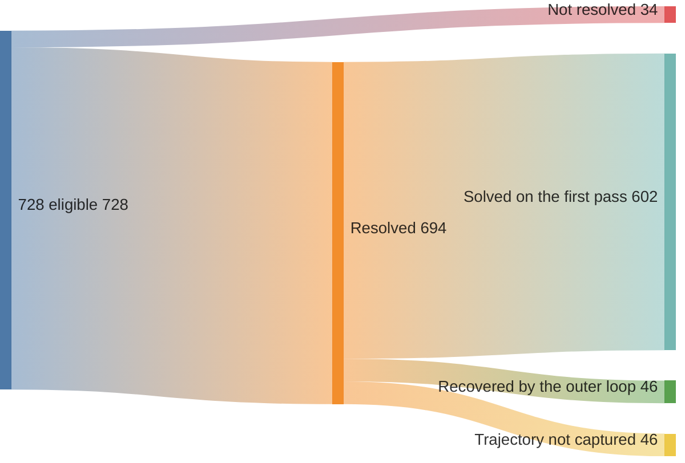
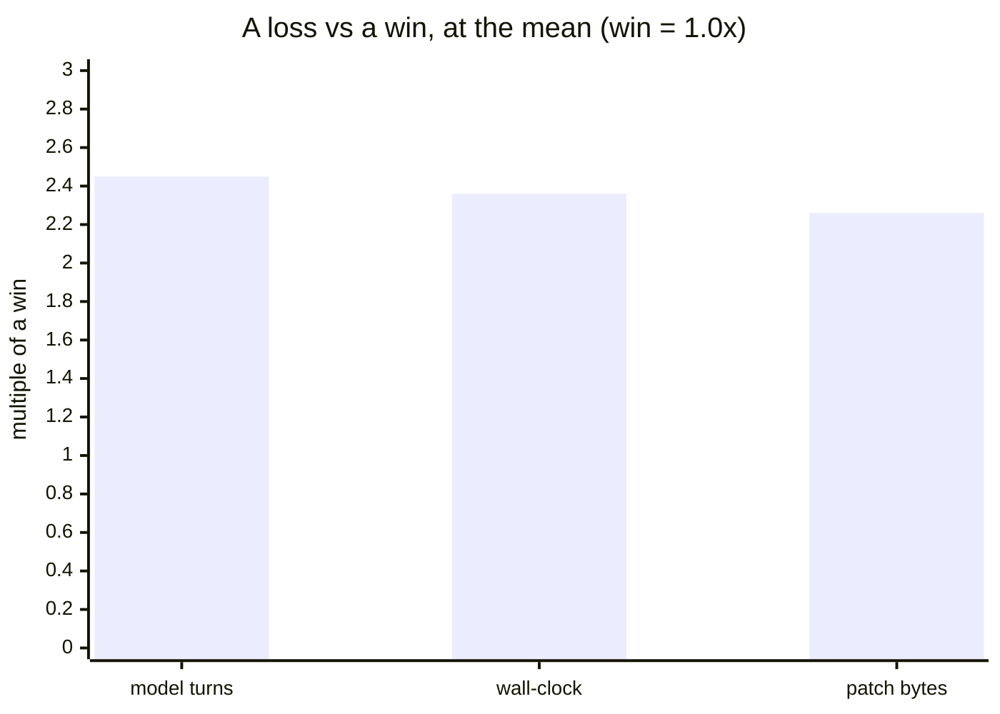
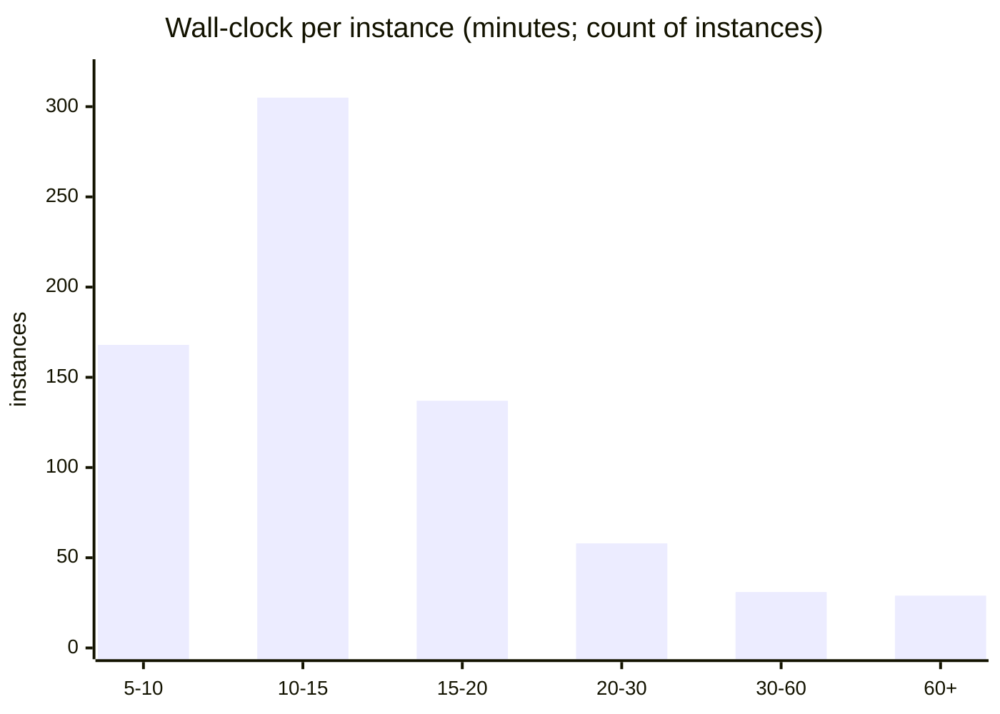
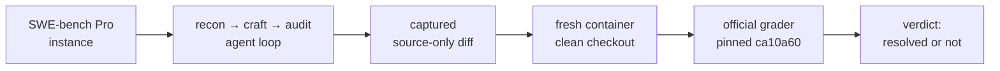

# swebench-pro

A **recon → craft → audit** harness pointed at **SWE-bench Pro**, run end-to-end
under a frozen, pre-registered protocol. The loop is
[applied methodeutics](https://june.kim/reading/methodeutics): abduce a hypothesis,
act on it, test and prune. Sibling repo:
[`swebench-verified`](https://github.com/kimjune01/swebench-verified).

## The result

The harness was pointed at all **728 eligible** SWE-bench Pro instances and resolved
**694** of them under the **official** grader, with **zero left ungraded**. That is
**95.33%**. The number is honest about its limits:

- It is the **public** split, so these repos can sit in a model's training data. This
  is a **system/harness** result, not a model-capability claim.
- **93% of wins land on the first pass.** The outer loop is mostly idle and recovers
  a small tail; it is not endless looping to scrape a number.
- **Every verdict is re-gradable** from a committed source-only diff, and you can
  reproduce a **random sample in one prompt** ([below](#reproduce-it-yourself)).

The same frozen harness was run with two model pairs:

| model pair | resolve | cost / instance | speed / instance |
|---|---|---|---|
| **Sonnet 4.5 + GPT-5.5** · frontier | **95.33%** · 694/728 | **~$5.14** | **~12.8 min** |
| **Composer 2.5 + Gemini Flash** · open-weight | **93.13%** · 678/728 | **~$0.41** | **~8.4 min** |

Costs are *economic* — every leg priced at public API rates, derived line-by-line in
[`COST_BASIS.md`](COST_BASIS.md). Both rows use the official grader on the same 728
eligible instances. The open-weight pair runs **~12.6× cheaper at 2.2 points lower
resolve**. The anatomy below details the frontier pair.

## How the loop behaves

One good shot plus a small recovery tail, not a grind. All 728 eligible instances flow
down to a verdict: 694 resolve, 34 do not, and among the wins with captured trajectories
the first recon → craft → audit pass already carries **93%**, with the outer loop
recovering the rest.

The outer loop earns its keep narrowly: it **converted 46 first-pass misses into wins**,
about 7% of the graded wins, and otherwise stays out of the way. First-pass / recovered
counts are over the 648 wins with captured trajectory data (the other 46 wins predate
trajectory capture). The loss-side anatomy, the per-depth breakdown, and the full-run
flow down to failure modes are in [`RESULTS.md`](RESULTS.md).

## What a loss is

A loss is **characterized, not located**: which repo it lands in says little, but its
*shape* is consistent. Against a win, a loss costs roughly **2.3 to 2.5x** at the mean
across the three axes that matter, model turns, wall-clock, and patch scope. The
harness wins on focused changes and loses on big-scope ones, so difficulty (patch
scope), not repo identity, is what separates win from loss.

All 34 losses are officially graded `not resolved` on **non-empty** patches, but
reading the artifacts shows they are not all capability losses: a few are harness
capture defects (one verified serialization defect alone would fail grading regardless
of the fix), and the most common pattern is the harness's own audit gate passing where
the official grader did not. The full characterization, with the verified-vs-inferred
split, is in [`RESULTS.md`](RESULTS.md).

## How fast it runs

Median **~13 min** per instance; 84% finish inside 5 to 20 minutes. The right tail is
heavy repos and craft-hangs on large suites, not the typical case.

The **~13 min** is per instance. The full 728-set took **~3.5 days** of wall-clock
end-to-end, bounded by fleet size (4 to 8 boxes) and three auth stalls, not by
per-instance speed. The run is embarrassingly parallel
([`SCOREBOARD.md`](SCOREBOARD.md), [`RUN_NOTES.md`](RUN_NOTES.md)).

## How a verdict is made

The agent's own opinion never counts. Its internal gate is only a stopping signal; the
verdict is always the **official** grade of the captured source-only diff, run on a
**fresh container** with the grader pinned at commit `ca10a60`.

This is why the gate-vs-official mismatches in the loss analysis exist at all: the
harness can think it passed and still be graded a loss. The grade is the diff's, not the
agent's. [`METHODOLOGY.md`](METHODOLOGY.md) has the full pipeline.

## Reproduce it yourself

Don't take the number on faith, and you don't need to rerun 728 instances or stand up
a cloud fleet. Pick a **random** sample, run the harness on *your* picks, grade with the
**official** grader; most instances run on your laptop under Docker/OrbStack (no EC2
unless a heavy repo is drawn), so a 20-instance check is ~$50 of your own tokens and an
afternoon. Paste this to your coding agent (codex, Claude Code, Cursor):

> I'm skeptical of the SWE-bench Pro result in github.com/kimjune01/swebench-pro
> (claimed 95.33% resolved). First, inspect `driver/bootstrap.sh` and the pipeline it
> invokes, and confirm it only pulls the pinned official eval repo, runs the grader in
> Docker, and uses my credentials locally; tell me what it does before running it.
> Then, following `CLAUDE.md`/`PROCEDURE.md`, run the **harness-under-test** on a
> **random** ~20-instance sample from `runs/audit/eligible.txt` (print your seed and
> ids), grade each with the **unmodified official** grader, and report resolved / 20
> with a confidence interval and whether it's consistent with 95.33%. Use my own
> machine and tokens. If you hit a snag, the repo's docs have the fix.

Goal-first on purpose: it points at the destination, not a recipe; a snag is a one-line
followup, not a blocker.

Free, no-token variant: re-grade our *committed* diffs instead. Every verdict's captured
source-only diff is in `runs/scored/artifacts.tar.zst`; re-grading a random handful on
fresh containers confirms the *recorded* verdicts are real. The prompt above is the
stronger check: it confirms the harness reproduces the *rate* on instances you choose.

## Will this hold on the private set?

Honestly, probably. The harness carries no per-instance priors, so there's no reason a
held-out split should break it. But the 95.33% is the public split, and four things
could still pull a private number down, in roughly descending order of concern:

- **Contamination.** Public repos can be in training data; the private split is held
  out for exactly this reason. The contamination caveat bounds the *absolute capability*
  reading, though not the harness-vs-harness delta on a fixed model.
- **Repo familiarity.** The loop benefits from public repos the model has likely seen;
  unfamiliar private code is the real test.
- **Same-family tuning.** The harness was developed on `swebench-verified` and adapted
  once for Pro; it has never touched the private split, but it shares a lineage with it.
- **Distribution shift.** Different repos, possibly a blind submission gate, and task
  shapes the loop hasn't been exercised on.

This is why the public number is framed as an audition, not a deliverable. The strategy
for the held-out set is in [`PREREGISTRATION.md`](PREREGISTRATION.md) §0 to §1.

## What the number is, and isn't

This is a **system** number, not a capability claim. The system is a Sonnet-4.5 generator
plus a GPT-5.5 craft challenger, both contaminated on these repos, with the
scaffold-vs-model axis a deliberately unclosed confound. The defensible reading is "this
frozen system resolved 694/728 under official grading," not "the model can solve 95% of
SWE-bench Pro." What the system is and why the confound stays open:
[`METHODOLOGY.md`](METHODOLOGY.md) and [`PREREGISTRATION.md`](PREREGISTRATION.md) §7/§12.

Provenance in brief: 728 = 731 dataset instances minus 3 whose own gold patch fails the
official grader (a pre-run defect audit, frozen before the scored run). Every figure
recomputes from `runs/scored/run.jsonl`; every verdict re-grades from its captured
source-only diff in `runs/scored/artifacts.tar.zst` (87 MB, 6,553 files; sha256 +
listing in `runs/scored/artifacts.MANIFEST.txt`). The run was **not uninterrupted**:
three provider-credential stalls and a mid-run switch from Max-subscription to paid API
billing, all recovered under the prereg's recovery discipline with 0 instances lost
([`RUN_NOTES.md`](RUN_NOTES.md)).

## Where to go next

| if you want to… | read |
|---|---|
| scan result · cost · speed with charts | [`SCOREBOARD.md`](SCOREBOARD.md) |
| audit the numbers and read the loss analysis | [`RESULTS.md`](RESULTS.md) |
| weigh the result against the obvious objections | [`OBJECTIONS.md`](OBJECTIONS.md) |
| understand how the number was produced | [`METHODOLOGY.md`](METHODOLOGY.md) |
| check the rules the run was held to | [`PREREGISTRATION.md`](PREREGISTRATION.md) |
| audit the run's provenance (stalls, cost, load) | [`RUN_NOTES.md`](RUN_NOTES.md) |
| reproduce a result from scratch | [`PROCEDURE.md`](PROCEDURE.md) |
| read the chronological trail | [`WORKLOG.md`](WORKLOG.md) |

## The method, the goal, and the fine print

**Methodeutics** is Peirce's name for the methodology of inquiry, the discipline of *how*
you reason from a puzzle to a warranted conclusion. It sits adjacent to **statistics**
(the formal account of induction) and **mathematics** (deduction), covering the third
inference neither owns: **abduction**. This repo is its empirical leg, methodeutics made
executable and measured (recon abduces, craft acts, audit tests); the theoretical leg is
the textbook at [june.kim/reading/methodeutics](https://june.kim/reading/methodeutics).

**The goal this run auditioned for:** a single frozen, instance-agnostic artifact that
clears SWE-bench Pro under official third-party grading on the held-out private set, in
one submission, verifiably free of per-instance priors. The public 95.33% is the
audition; the deliverable is the artifact plus its reproducible attestation trail
([`PREREGISTRATION.md`](PREREGISTRATION.md) §0 to §1).

**Funding:** this benchmark work was self-funded, on the author's own EC2 and Claude Max
subscription, with no external or institutional funding ([`RUN_NOTES.md`](RUN_NOTES.md)).

**License:** repo CC BY-SA-NS ([`LICENSE.md`](LICENSE.md)); skills (`skills/`)
dual-licensed CC BY-SA-NS **or** GPL-3.0, recipient's choice
([`skills/LICENSE.md`](skills/LICENSE.md)).
