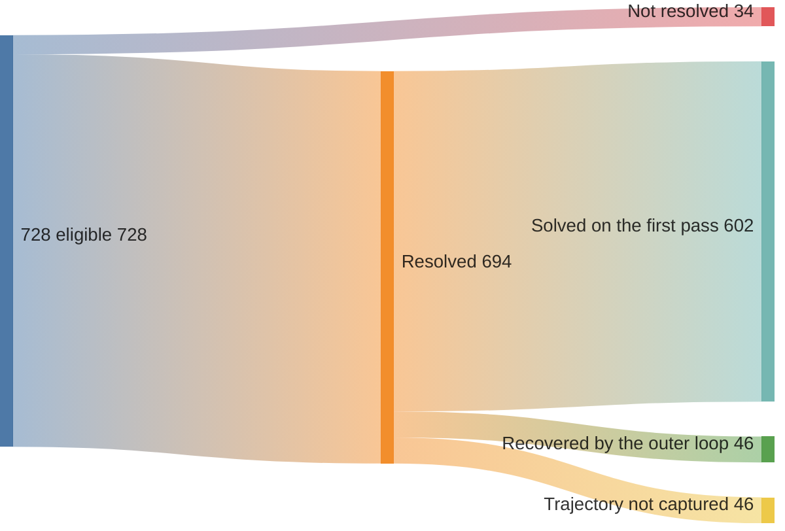
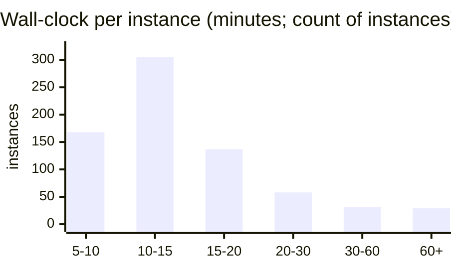

# swebench-pro

A **methodeutic** harness pointed at **SWE-bench Pro**, run end-to-end
under a frozen, pre-registered protocol. The loop is
[applied methodeutics](https://june.kim/reading/methodeutics) — three skills: **recon**
abduces a hypothesis, **craft** acts on it, **audit** tests and prunes. Sibling repo:
[`swebench-verified`](https://github.com/kimjune01/swebench-verified).

## The result

| model pair | resolve | cost / instance | speed / instance |
|---|---|---|---|
| **Sonnet 4.5 + GPT-5.5** · frontier | **95.33%** · 694/728 | **~$5.14** | **~12.8 min** |
| **Composer 2.5 + Gemini Flash** · open-weight | **93.13%** · 678/728 | **~$0.41** | **~8.4 min** |

The same frozen harness, two model pairs. Both rows use the **official** grader on the
same **728 eligible** instances, with **zero left ungraded**. Costs are *economic* —
every leg priced at public API rates, derived line-by-line in
[`COST_BASIS.md`](docs/COST_BASIS.md); the open-weight pair runs **~12.6× cheaper at 2.2
points lower resolve**.

The anatomy below details the **frontier** run: 694 of 728 resolved, **95.33%**. The
number is honest about its limits:

- It is the **public** split, so these repos can sit in a model's training data. This
  is a **system/harness** result, not a model-capability claim.
- **93% of wins land on the first pass.** The outer loop is mostly idle and recovers
  a small tail; it is not endless looping to scrape a number.
- **Every verdict is re-gradable** from a committed source-only diff, and you can
  reproduce a **random sample in one prompt** ([below](#reproduce-it-yourself)).

## The harness iterates

One good shot plus a small recovery tail rather than a grind. All 728 eligible instances flow
down to a verdict: 694 resolve, 34 do not, and among the wins with captured trajectories
the first methodeutic pass already carries **93%**, with the outer loop
recovering the rest.

The outer loop earns its keep narrowly: it **converted 46 first-pass misses into wins**,
about 7% of the graded wins, and otherwise stays out of the way. First-pass / recovered
counts are over the 648 wins with captured trajectory data (the other 46 wins predate
trajectory capture). The loss-side anatomy, the per-depth breakdown, and the full-run
flow down to failure modes are in [`RESULTS.md`](docs/RESULTS.md).

## What it costs

The per-instance figures in the table are *economic* — every leg priced at a published
API rate and traced line-by-line from committed token totals, so a third party can
reproduce them. The frontier pair runs **~$5.14**; the open-weight pair does the same
work for **~$0.41**. The operator's actual cash was far lower, most of it absorbed by
flat subscriptions (Claude Max, codex, Cursor) at roughly zero marginal cost. The full
arithmetic for both pairs, plus the cash-vs-economic reconciliation, is in
[`COST_BASIS.md`](docs/COST_BASIS.md).

## How fast it runs

Median **~13 min** per instance; 84% finish inside 5 to 20 minutes. The right tail is
heavy repos and craft-hangs on large suites, well outside the typical case.

The **~13 min** is per instance. The full 728-set took **~3.5 days** of wall-clock
end-to-end, bounded by fleet size (4 to 8 boxes) and three auth stalls, not by
per-instance speed. The run is embarrassingly parallel
([`SCOREBOARD.md`](docs/SCOREBOARD.md), [`RUN_NOTES.md`](docs/RUN_NOTES.md)).

## How a verdict is made

The agent's own opinion never counts. Its internal gate is only a stopping signal; the
verdict is always the **official** grade of the captured source-only diff, run on a
**fresh container** with the grader pinned at commit `ca10a60`.

Every **fail** branch is what we count as a loss — all 34 are real graded `not resolved`
on **non-empty** patches, with no empty captures padding the wins. The harness can think
it passed (its audit gate green) and still be graded a loss; the grade is the diff's
alone. Full loss breakdown in [`RESULTS.md`](docs/RESULTS.md); the pipeline is in
[`METHODOLOGY.md`](docs/METHODOLOGY.md).

## Reproduce it yourself

Don't take the number on faith, and you don't need to rerun 728 instances or stand up
a cloud fleet. Pick a **random** sample, run the harness on *your* picks, grade with the
**official** grader; most instances run on your laptop under Docker/OrbStack (no EC2
unless a heavy repo is drawn), so a 20-instance check is an evening of subscription
tokens. Paste this to **any coding-grade agent** — codex, Claude Code, Cursor,
Gemini CLI, whatever you run. The open-weight ablation shows the harness isn't
model-picky, so the repro steps don't depend on a particular vendor or tier:

> I'm skeptical of the SWE-bench Pro result in github.com/kimjune01/swebench-pro
> (claimed 95.33% resolved). First, inspect `driver/bootstrap.sh` and the pipeline it
> invokes, and confirm it only pulls the pinned official eval repo, runs the grader in
> Docker, and uses my credentials locally; tell me what it does before running it.
> Then, following `CLAUDE.md`/`docs/PROCEDURE.md`, run the **harness-under-test** on a
> **random** ~20-instance sample from `runs/audit/eligible.txt` (print your seed and
> ids), grade each with the **unmodified official** grader, and report resolved / 20
> with a confidence interval and whether it's consistent with 95.33%. Use my own
> machine and tokens. If you hit a snag, the repo's docs have the fix.

Goal-first on purpose: it points at the destination instead of a recipe; a snag is a one-line
followup, never a blocker.

Free, no-token variant: re-grade our *committed* diffs instead. Every verdict's captured
source-only diff is in `runs/scored/artifacts.tar.zst`; re-grading a random handful on
fresh containers confirms the *recorded* verdicts are real. The prompt above is the
stronger check: it confirms the harness reproduces the *rate* on instances you choose.

## Will this hold on the private set?

Probably. The harness carries no per-instance priors, so there's no reason a
held-out split should break it. But the 95.33% is the public split, and four things
could still pull a private number down, in roughly descending order of concern:

- **Contamination.** Public repos can be in training data; the private split is held
  out for exactly this reason. The contamination caveat bounds the *absolute capability*
  reading, though not the harness-vs-harness delta on a fixed model.
- **Repo familiarity.** The loop benefits from public repos the model has likely seen;
  unfamiliar private code is the real test.
- **Same-family tuning.** The harness was developed on `swebench-verified` and adapted
  once for Pro; it has never touched the private split, but it shares a lineage with it.
- **Distribution shift.** Different repos, possibly a blind submission gate, and task
  shapes the loop hasn't been exercised on.

**A contamination-free check already exists.** Over a **~10-day** run the same
methodeutic loop shipped **81 merged PRs into 73 cold repos** — codebases it
didn't own and held no training priors for: fresh, post-cutoff issues, accepted by real
maintainers at a **~50% merge rate** (81 of 160 decided). That rate is a *floor* on
correctness, not an estimate of it: a close-reason audit found only ~8 of the 79 closures
were rejections on the merits — the rest were no-AI policies, AI discrimination, author
withdrawals, and duplicates, none of which mean the fix was wrong — so the share of
*correct* solutions runs well above 50%. The ledger is committed
([`pr-receipts.jsonl`](docs/pr-receipts.jsonl)) and verifiable two ways — recompute from the
file or rerun the live GraphQL ([`pr-receipts.VERIFY.md`](docs/pr-receipts.VERIFY.md)); the
OSS program's [hypothesis graph](docs/OSS_HYPOTHESIS_GRAPH.md) has the per-failure-mode
breakdown. That tests the repo-familiarity and
distribution-shift worries head-on, where training-data overlap can't help: a maintainer
merges the fix or closes it. These came from the sibling
[`sweep`](https://github.com/kimjune01/sweep) pipeline — the same methodeutics lineage
rather than a byte-for-byte transplant of this harness — so read it as evidence for the
method, with the open-weight ablation above as the evidence for *this* scaffold.

This is why the public number is framed as an audition, short of a deliverable. The strategy
for the held-out set is in [`PREREGISTRATION.md`](docs/PREREGISTRATION.md) §0 to §1.

## What the score actually measures

The score measures the **harness**, not the model. It's what the methodeutic loop —
recon, craft, audit — extracts on top of whatever model fills its stages: the diagnosis
discipline, the anti-cheat capture rules, the audit gate, the recovery loop. The open-weight ablation pins that down — swap the frontier pair for cheap
open-weight models and the same frozen harness still resolves **93.13%**, a 2.2-point dip,
so the loop's structure, not a frontier model's raw capability, carries most of the
result. The system here is a Sonnet-4.5 generator plus a GPT-5.5 craft challenger, both
contaminated on these repos, with the strict scaffold-vs-model control deliberately
unclosed. The defensible reading is "the methodeutic harness resolved 694/728 under
official grading," not "the model can solve 95% of SWE-bench Pro." What the system is and why the confound stays open:
[`METHODOLOGY.md`](docs/METHODOLOGY.md) and [`PREREGISTRATION.md`](docs/PREREGISTRATION.md) §7/§12.

Provenance in brief: 728 = 731 dataset instances minus 3 whose own gold patch fails the
official grader (a pre-run defect audit, frozen before the scored run). Every figure
recomputes from `runs/scored/run.jsonl`; every verdict re-grades from its captured
source-only diff in `runs/scored/artifacts.tar.zst` (87 MB, 6,553 files; sha256 +
listing in `runs/scored/artifacts.MANIFEST.txt`). The run was **not uninterrupted**:
provider-credential (auth) stalls, token-quota stoppages, the occasional box crash (heavy
images exhausting disk), and a mid-run switch from Max-subscription to paid API billing.
None of these count as losses — the recovery discipline re-dispatches only instances that
captured a **0-byte patch** (no submission ever happened), while any *non-empty* patch
graded `not resolved` stays a LOSS mechanically. So infrastructure failure is discounted
from the score by construction, not by judgment: the 34 losses are genuine graded
outcomes, and all stalls recovered with 0 instances lost
([`RUN_NOTES.md`](docs/RUN_NOTES.md), [`PREREGISTRATION.md`](docs/PREREGISTRATION.md) §14).

The whole campaign is on the record decision-by-decision: an append-only
[`WORKLOG.md`](docs/WORKLOG.md) timestamps every choice, dead end, and losing run as it
happened — a lab notebook left open, not a tidied-up writeup. That's still rare for a
benchmark result, and it's the point: the trail that produced the number is as auditable
as the number.

## Where to go next

| If you want to… | Read |
|---|---|
| Scan result · cost · speed with charts | [`SCOREBOARD.md`](docs/SCOREBOARD.md) |
| Audit the numbers and read the loss analysis | [`RESULTS.md`](docs/RESULTS.md) |
| Trace the per-instance cost arithmetic | [`COST_BASIS.md`](docs/COST_BASIS.md) |
| Read the economic argument (job-shop unit cost) | [`DISCUSSION.md`](docs/DISCUSSION.md) |
| Weigh the result against the obvious objections | [`OBJECTIONS.md`](docs/OBJECTIONS.md) |
| Check the contamination-free OSS receipts | [`pr-receipts.VERIFY.md`](docs/pr-receipts.VERIFY.md) |
| Understand how the number was produced | [`METHODOLOGY.md`](docs/METHODOLOGY.md) |
| See how the harness ported from Verified to Pro | [`PRO_PORT.md`](docs/PRO_PORT.md) |
| Check the rules the run was held to | [`PREREGISTRATION.md`](docs/PREREGISTRATION.md) |
| Read the open-weight ablation's pre-registration | [`PREREGISTRATION-cheap-ablation.md`](docs/PREREGISTRATION-cheap-ablation.md) |
| Audit the run's provenance (stalls, cost, load) | [`RUN_NOTES.md`](docs/RUN_NOTES.md) |
| Reproduce a result from scratch | [`PROCEDURE.md`](docs/PROCEDURE.md) |
| Read the chronological trail | [`WORKLOG.md`](docs/WORKLOG.md) |

## The method, the goal, and the fine print

**Methodeutics** is Peirce's name for the methodology of inquiry, the discipline of *how*
you reason from a puzzle to a warranted conclusion. It sits adjacent to **statistics**
(the formal account of induction) and **mathematics** (deduction), covering the third
inference neither owns: **abduction**. This repo is its empirical leg, methodeutics made
executable and measured (recon abduces, craft acts, audit tests); the theoretical leg is
the textbook at [june.kim/reading/methodeutics](https://june.kim/reading/methodeutics).

**The goal this run auditioned for:** a single frozen, instance-agnostic artifact that
clears SWE-bench Pro under official third-party grading on the held-out private set, in
one submission, verifiably free of per-instance priors. The public 95.33% is the
audition; the deliverable is the artifact plus its reproducible attestation trail
([`PREREGISTRATION.md`](docs/PREREGISTRATION.md) §0 to §1).

**Funding:** this benchmark work was self-funded, on the author's own EC2 and Claude Max
subscription, with no external or institutional funding ([`RUN_NOTES.md`](docs/RUN_NOTES.md)).

**License:** repo CC BY-SA-NS ([`LICENSE.md`](LICENSE.md)); skills (`skills/`)
dual-licensed CC BY-SA-NS **or** GPL-3.0, recipient's choice
([`skills/LICENSE.md`](skills/LICENSE.md)).
