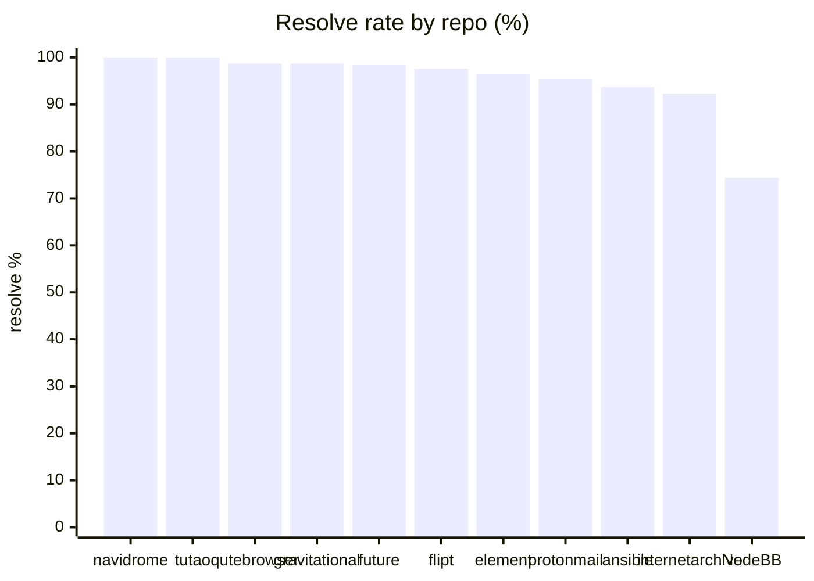
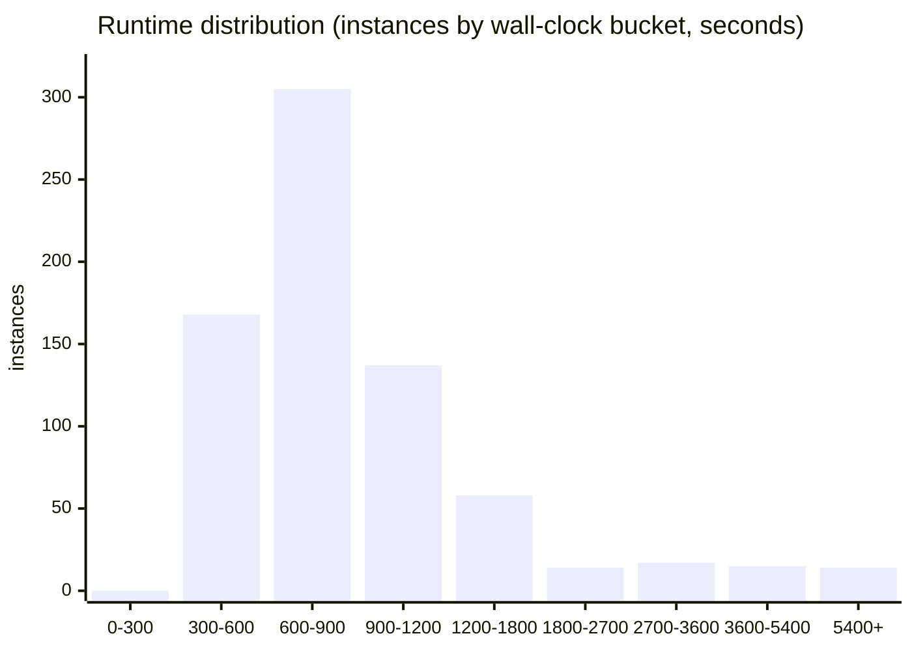
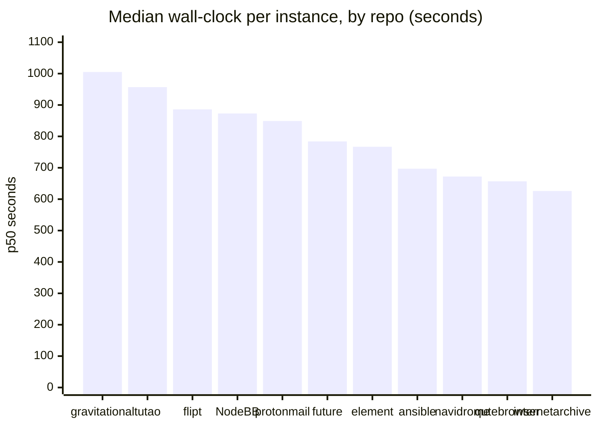
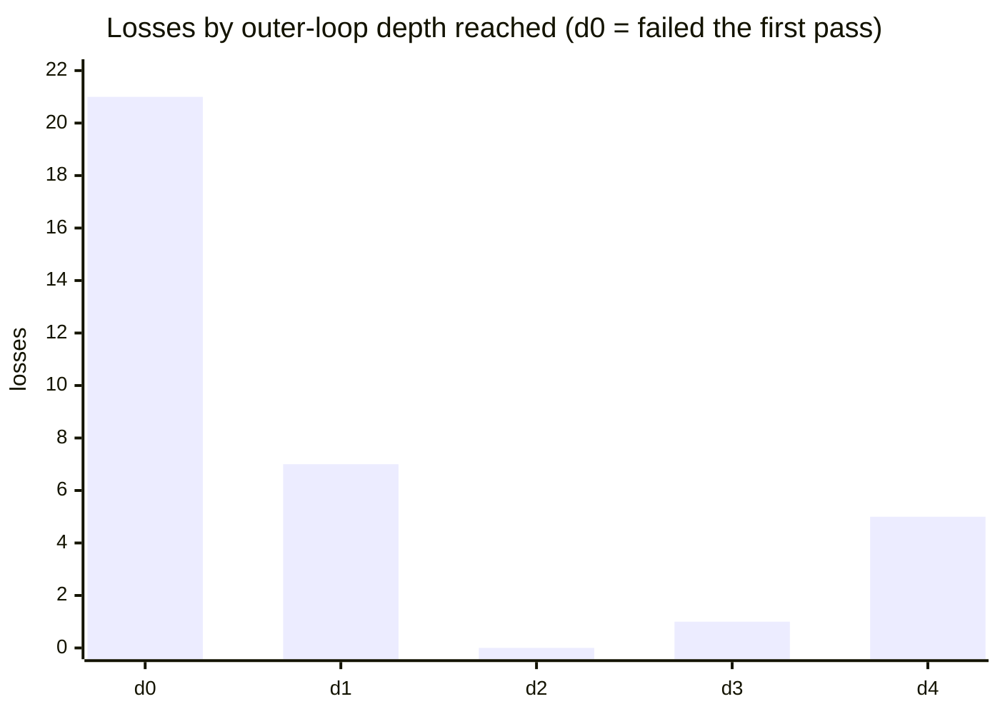
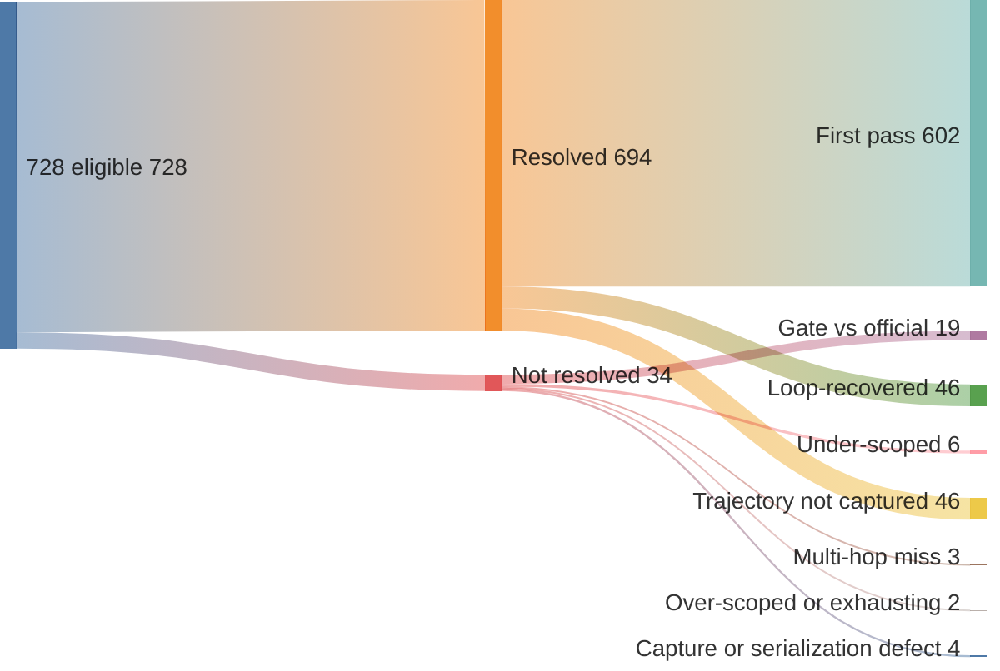

# Results: SWE-bench Pro, frozen tag `prereg-pro-v1`

**694 / 728 eligible resolved = 95.33%**, official Pro grader, single frozen
instance-blind artifact, whole eligible set in one measurement. All numbers
below are recomputed from `runs/scored/run.jsonl` (last-wins dedupe by
`instance_id`, matching the `./score` tool). A reader can re-derive every
figure here from that ledger; the per-instance captured diffs in the
committed bundle `runs/scored/artifacts.tar.zst` let a reader re-grade any
single verdict (PROCEDURE §6).

- **Eligible denominator:** 728 (731 dataset instances − 3 gold-patch defects).
  The three excluded ids and their grader output are committed in
  `runs/audit/defects.jsonl`; the kept set is `runs/audit/eligible.txt`
  ([`PREREGISTRATION.md`](PREREGISTRATION.md) §6).
- **Terminal verdicts:** 728 (694 WIN, 34 LOSS), **0 INCOMPLETE**: full coverage.
- **Resolve-rate:** W / (W + L) = 694 / 728 = 95.33%.
- **Run span:** ~3.5 days end-to-end (first dispatch 2026-05-27 00:58Z → last
  verdict 2026-05-30 17:37Z); **not uninterrupted:** three provider-credential stalls and a mid-run switch
  from Max-subscription to paid API billing, all recovered with 0 instances
  lost. Provenance in [`RUN_NOTES.md`](RUN_NOTES.md).

This is a **system result**, not a capability claim: a Sonnet-4.5 generator
plus a GPT-5.5 craft challenger, both contaminated on these repos, in the
applied-methodeutics scaffold (recon→craft→audit). See [`PREREGISTRATION.md`](PREREGISTRATION.md) §7,
§12 for what that confound costs the claim. The headline is a bench number, not
evidence that either model "reasoned" the fixes.

## Excluded instances: 3 gold-patch defects (why the denominator is 728, not 731)

Three of the 731 dataset instances are **not in the eligible set, and were never
run against our system**. The reason is a property of the bench, not a choice we
made about our results: in a pre-run audit (2026-05-26, before any scored model
run) we graded **every instance's own gold patch** through the official grader
on a clean base. For these three, the gold patch itself graded **NOT RESOLVED**:
the benchmark's own reference solution fails its own tests. An instance whose
correct answer can't pass cannot fairly score our answer, so it is excluded and
documented, one per language:

| instance_id | lang | grader verdict on gold | audit s |
|---|---|---|---:|
| `instance_future-architect__vuls-bff6b755…-v1151a632…` | Go | gold NOT resolved | 114 |
| `instance_NodeBB__NodeBB-00c70ce7…-vnan` | JS | gold NOT resolved (4/681 F2P tests absent, name-collision/flaky) | 82 |
| `instance_ansible__ansible-de5858f4…-v1055803c…` | Py | gold NOT resolved | 22 |

The full ids and grader output are committed in `runs/audit/defects.jsonl`; the
kept set of 728 is `runs/audit/eligible.txt`. This is the **only** reason any
instance went unrun: there are **0 INCOMPLETE** in the scored set, so every
other one of the 728 has a terminal WIN/LOSS.

Two points that matter for an auditor:
- **The exclusion basis is our model's results-independent.** The defect list was
  frozen *before* the scored run and keys only on gold-patch behavior, so it
  cannot be a post-hoc drop of instances we happened to fail. No defect may be
  added after model results are visible
  ([`PREREGISTRATION.md`](PREREGISTRATION.md) §6).
- **These three are not counted anywhere in the headline**, not as wins, not as
  losses, not as incompletes. They are removed from the denominator entirely.
  The 0.4% defect rate (3/731) is itself reported, not hidden.

## Per-repo breakdown

Eleven public repos. `W`/`L` are terminal official verdicts; `%win` is
W/(W+L). Runtime columns are wall-clock seconds per terminal instance (recon +
craft + audit + capture + grade), recomputed across all 728.

| repo | W | L | %win | mean s | p50 s | p90 s | max s |
|---|---:|---:|---:|---:|---:|---:|---:|
| navidrome | 57 | 0 | 100.0 | 918 | 672 | 1231 | 5085 |
| tutao | 20 | 0 | 100.0 | 1194 | 957 | 1431 | 4070 |
| qutebrowser | 78 | 1 | 98.7 | 771 | 657 | 1100 | 3663 |
| gravitational | 75 | 1 | 98.7 | 1474 | 1005 | 2393 | 10745 |
| future | 60 | 1 | 98.4 | 937 | 784 | 1148 | 3789 |
| flipt | 83 | 2 | 97.6 | 1111 | 886 | 1442 | 6339 |
| element | 54 | 2 | 96.4 | 1200 | 767 | 2401 | 7619 |
| protonmail | 62 | 3 | 95.4 | 1362 | 849 | 2995 | 7037 |
| ansible | 89 | 6 | 93.7 | 919 | 697 | 1294 | 6391 |
| internetarchive | 84 | 7 | 92.3 | 726 | 626 | 1082 | 4347 |
| NodeBB | 32 | 11 | 74.4 | 1433 | 873 | 3178 | 6441 |
| **total** | **694** | **34** | **95.33** | **1060** | **770** | **1537** | **10745** |

Repo labels are the dataset org prefix; the canonical instance ids are
`instance_<org>__<repo>-<sha>` (e.g. `gravitational` is
`gravitational__teleport`, `flipt` is `flipt-io__flipt`, `element` is
`element-hq__element-web`, `future` is `future-architect__vuls`).

Resolve rate by repo, sorted:



Ten of eleven repos resolve at 92.3% or above. **NodeBB at 74.4% sits 18
points below the next-lowest repo (internetarchive, 92.3%) and contributes 11
of the 34 total losses** (see below).

## Development-overlap check: did developing on Verified inflate Pro?

The harness was developed and iterated on SWE-bench Verified before this run
([`METHODOLOGY.md`](METHODOLOGY.md) "Harness provenance"). If that development
overfit the pipeline, the repos closest to the development set should resolve
*higher* than novel ones. We test it two ways.

**Repo overlap: none.** Zero of the 11 Pro-public repos appear in Verified's
dev set (Verified is Python scientific/web libraries: django, sympy,
matplotlib, scikit-learn, …; Pro-public is qutebrowser, ansible, openlibrary,
navidrome, teleport, vuls, flipt, element-web, webclients, tutanota, NodeBB).
So there is no instance- or repo-level path from development into this run. The
only shared channel is *language*: Verified is all Python, and three Pro repos
are Python.

**Language split: the dev-language is not advantaged.** Grouping the 728 by
language (Python = the development language; Go/TS/JS = never touched in
development):

| group | repos | resolve |
|---|---|---:|
| Python (dev-language) | qutebrowser, ansible, openlibrary | 251 / 265 = **94.7%** |
| non-Python (novel) | Go, TypeScript, JavaScript | 443 / 463 = **95.7%** |

The Python group resolves **1.0 point lower**, not higher. By language: Go
98.6% (279), TS 96.5% (141), Python 94.7% (265), JS 74.4% (43). The strongest
group (Go) and the weakest (JS/NodeBB) are *both* novel languages. **No
development-overfit signal appears in the direction the hypothesis predicts**.
The spread tracks per-repo and per-language difficulty, not proximity to the
development set. This is the empirical check the freeze-timing audit cannot
provide (the harness co-evolved with Pro pilots before freeze, see
[`METHODOLOGY.md`](METHODOLOGY.md)); the freeze does not defend, this does.

## Runtime distribution

All 728 terminal instances, by wall-clock bucket (seconds):



The mass sits at 300–1200 s (610 / 728 = 84%); median 770 s. The right tail is
heavy repos (webclients, teleport) and craft-hangs on big test suites; the
`craft 3600` stage cap is per-stage, so a multi-cycle outer loop on a slow
suite can stack well past it. The single longest run is a 10,745 s
`gravitational__teleport` WIN.

Median runtime by repo (the per-repo table above has the full mean/p50/p90/max):



Most repos cluster around 650–900 s; gravitational (teleport) and tutao run
slowest, internetarchive fastest. The spread is under 2x at the median, so the
heavy tail in the distribution above is the long-pole instances, not slow repos
across the board.

## Loss analysis: all 34 have non-empty patches

Every loss is a real graded `not resolved` verdict on a non-empty captured
patch. **None is an empty-capture or no-patch loss.** Patch sizes across the 34
loss diffs:

| stat | bytes |
|---|---:|
| min | 765 |
| median | 3,607 |
| max | 194,336 |
| empty (0 B) | **0** |

This matters for the integrity direction: a loss here is the loop *producing a
fix the official tests rejected*, not the loop failing to produce anything. The
prereg counts both as LOSS (§4), but the distinction is what the patches show.

Losses by repo, with the loss-instance runtimes:

| repo | losses | loss runtimes (s) |
|---|---:|---|
| NodeBB | 11 | 508, 540, 552, 678, 679, 749, 812, 856, 962, 1355, 6441 |
| internetarchive | 7 | 407, 558, 655, 774, 782, 1082, 1599 |
| ansible | 6 | 766, 1125, 1266, 3065, 5417, 6391 |
| protonmail | 3 | 1446, 5562, 7037 |
| future | 1 | 2839 |
| element | 2 | 6321, 7619 |
| flipt | 2 | 512, 1725 |
| qutebrowser | 1 | 762 |
| gravitational | 1 | 8202 |

### What a loss costs, and what the outer loop does

Which repo a loss lands in says little (and means nothing to a reader who doesn't
know the repos). What a loss *is* says more. A loss is not a cheap miss: against a
win, it burns roughly double the model turns and, at the mean, triple the
wall-clock and patch churn.

| per instance | WIN median | LOSS median | WIN mean | LOSS mean |
|---|---:|---:|---:|---:|
| model turns | 137 | 242 | 180 | **441** |
| wall-clock s | 766 | 1,022 | 996 | **2,354** |
| patch bytes | 2,808 | 3,572 | 5,050 | **11,396** |

The median gaps are modest; the mean gaps blow out because a tail of losses
thrashes to exhaustion. Two findings behind that, neither repo-specific:

- **Scope predicts the outcome.** Loss patches run ~2x the win patches at the mean
  (11.4 vs 5.0 KB). The harness wins on focused changes and loses on big-scope
  ones, so difficulty (patch scope), not repo identity, is what separates W from L.
- **The outer loop is mostly idle, occasionally decisive.** Of wins with trajectory
  data (648), **93% land on the first recon→craft→audit pass** (loop depth 0); the
  loop recovers the other **7% (46 wins)** the first pass missed. Losses split by
  depth: most fail fast at depth 0 (a wrong answer, no recovery), but a tail
  exhausts the full loop (the craft-hang wall), which is where the expensive-failure
  compute concentrates.



So a loss is characterized, not located: big-scope, compute-heavy, and either
fast-wrong (depth 0) or loop-exhausting (depth 4). That is the attribution a
per-repo tally cannot give.

### What the 34 losses actually are

All 34 captured diffs and their final-depth trajectories were read by hand to
characterize *why* each lost. This is a reading of the artifacts, not a re-grade, so
treat the mode counts as a provisional characterization rather than a measured split.
The honest headline: **not all 34 are capability losses.** A few are harness defects
(the capture or auth pipeline failed), and the most common pattern is the harness's
own audit gate passing on a fix that the official grader then rejected.

The whole run as one flow, from the 728 eligible instances down to where the 34 losses
land:



The loss-side splits are the provisional characterization below, not measured counts;
the win-side first-pass / recovered split is over the 648 wins with captured
trajectories (the other 46 wins predate trajectory capture).

| failure mode | approx. count | what it means |
|---|--:|---|
| gate-vs-official mismatch | ~19 | the harness audit looked satisfied (its local tests passed) but the official grader said `not resolved`. Leading pattern, but **inferred from the trajectories, not yet verified** against official per-test output. |
| under-scoped | ~6 | right file and direction, incomplete fix; a fuller patch would have passed. |
| multi-hop / cross-file miss | ~3 | a chained change partly applied; one of several coordinated edits missed. |
| over-scoped or loop-exhausting | ~2 | sprawling rework that never converged, or thrashed to the depth-4 cap. |
| capture / serialization defect | ~4 | the captured diff itself is broken or incomplete, so it would fail grading regardless of the reasoning. **Verified** for at least one (below). |

Two things here are **verified**, not inferred:

- **At least one loss is a serialization defect, not a reasoning failure.** In
  `openlibrary-9bdfd29...`, the captured diff has every Python string-literal quote
  stripped (`hasattr(val, children)`, `combined =  .join(words)`, `Phrase(f{normed})`).
  The patch cannot parse, so it was guaranteed to fail official grading no matter how
  sound the underlying fix was. This is a capture-pipeline defect that manufactures a
  false loss, the same class flagged in [`docs/bench-defects.md`](docs/bench-defects.md).
- **Several captured diffs leaked scratch files** (`fix.py`, `auth.yaml`,
  `appendonly.aof.manifest`) committed alongside the real source edits. The source
  edits are present (no loss has an empty source patch), but the leaked files are a
  capture-hygiene issue worth scrubbing before the next run.

So the true *capability*-loss count is below 34: subtract the verified capture defects,
and the gate-vs-official cases are the band where a better audit gate, not a smarter
model, would close the gap. Confirming the exact split needs a re-grade of the
source-corrected patches, which this run's budget did not cover; it is the first item
for the next campaign. Every claim above is checkable against the committed artifacts.

### Reading any loss yourself

Every loss is committed as an inspectable artifact, not a summary. All 6,553
artifact files (860 captured diffs, the Claude and GPT-5.5 trajectories, and the
per-box ledgers) are committed as a single compressed bundle,
`runs/scored/artifacts.tar.zst` (87 MB, sha256 + full file listing in
`runs/scored/artifacts.MANIFEST.txt`, browsable without unpacking). Unpack:

```
cd runs/scored && zstd -dc artifacts.tar.zst | tar -xf -
# yields artifacts/coord<N>/{patches,claude,codex}/...
#   patches/pro_patch_<instance_id>.diff   captured source-only diff (the graded patch)
#   claude/...craft-<instance_id>...        Claude recon/craft/audit session JSONLs
#   codex/...                               GPT-5.5 craft-challenger sessions
```

A concrete one to open first:
`artifacts/coord*/patches/pro_patch_instance_gravitational__teleport-c782838c3a174fdff80cafd8cd3b1aa4dae8beb2.diff`
is the gravitational/teleport loss that ran the outer loop all the way to depth 4
(the 8,202 s case at the top of this section). Its diff shows what the loop
eventually committed, and its trajectory dirs (`-d0` through `-d4`) show recon
narrowing on each pass and the audit's tests still failing at the cap.

To audit any loss: take its `pro_patch_*.diff`, build `pred.json`, and re-grade
on a clean container per PROCEDURE §3 / §6. Re-grading the captured diff under
the pinned procedure reproduces the `not resolved` verdict without re-running
the agent; the grade reads only the diff, modulo the grader pathologies
documented in [`docs/bench-defects.md`](docs/bench-defects.md). The trajectory
JSONLs show *why* the loop emitted that diff.

## Open question: ansible runtime shape (flagged, not a finding)

Early in the run, ansible losses looked **bimodal by verdict**: crisp WINs
(~780 s mean) versus catastrophic LOSSes (early sample ~3200 s), suggesting
ansible's module-coupled test collection punishes a craft attempt that misses
the call graph; each extra adversary cycle re-pays a large pytest-collection
cost (worklog 2026-05-30 15:35Z; same shape as the documented sympy/matplotlib
craft-hang).

**The full six-loss sample does not support the clean split.** Ansible WIN mean
is 778 s; the six losses are 766, 1125, 1266, 3065, 5417, 6391; three of them
sit inside the WIN range. The "fast WIN vs slow wall" story holds for the tail
(3065–6391 s craft-hangs) but breaks for the three sub-1300 s losses, which are
ordinary graded fails, not collection blowups. So this is **an open question
for the next campaign, not a result**: whether stricter test-scoping in the
craft prompt ("test only files the diff touches, not the package") removes the
tail without changing the fast losses. It is a hypothesis to test on practice
rungs, deliberately not acted on mid-run (the artifact was frozen).

## Independent re-grade spot-check: no binding leak

The standing worry about any agent result is **local-green / official-red**: the
loop's own gate calls a WIN, but the captured diff fails when an independent
party runs the real grader (a capture artifact, a serialization quirk, a gate
that disagrees with the grader). To test it directly, we took a cross-language
sample of 6 WINs, rebuilt `pred.json` from each committed diff, and re-graded on
fresh containers with the **unmodified** official grader (pinned commit
`ca10a60`), no agent re-run, no model tokens.

| repo | lang | re-grade verdict | grade s |
|---|---|---|---:|
| flipt | Go | RESOLVED | 207 |
| navidrome | Go | RESOLVED | 69 |
| vuls | Go | RESOLVED | 173 |
| qutebrowser | Python | RESOLVED | 55 |
| openlibrary | Python | RESOLVED | 63 |
| tutanota | TypeScript | RESOLVED | 174 |

**6/6 reproduced RESOLVED.** No binding leak in the sample. This is a spot-check
(n=6 of 694, not the full set; a full re-grade is feasible but unrun here), and
it is consistent by construction with the run's own design: each WIN was already
an official-grader verdict on the captured source-only diff at run time (the gate
is never the verdict; PROCEDURE §3). The re-grade confirms a third party
reproduces those verdicts from the committed artifacts alone.

## Verifying the tally

```bash
./score                       # prints WIN/LOSS, resolve-rate, coverage from run.jsonl
./score runs/scored/run.jsonl # same, explicit ledger path
```

`./score` applies last-wins dedupe by `instance_id` over all ledger events
(the run.jsonl carries the full event trail including requeues, so the raw line
count exceeds 728). The deduped terminal set is 728: 694 WIN, 34 LOSS, 0
INCOMPLETE. The per-repo and runtime figures above come from the same dedupe;
the recompute script is reproduced inline in this repo's history if you want to
diff it against your own.
