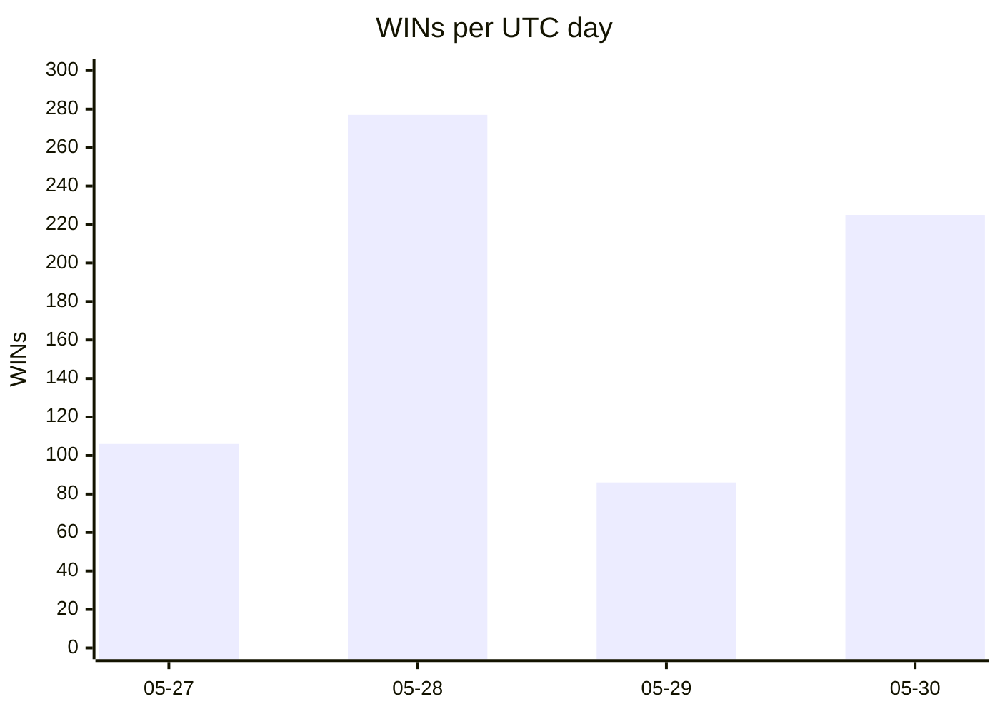
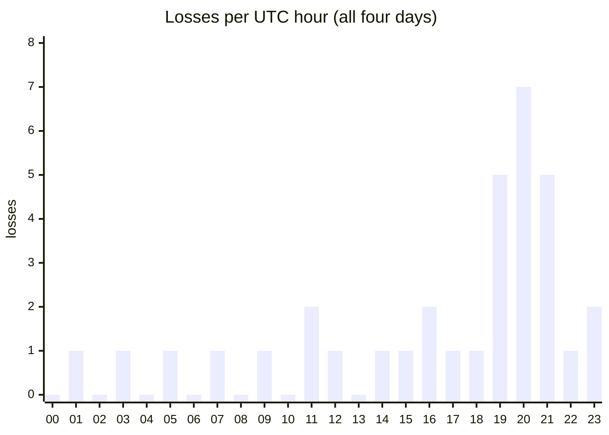

# Run notes: provenance for `prereg-pro-v1`

The audit trail for the 95.33% measurement: what interrupted the run, how each
interruption was recovered, what it cost, and the load pattern that shaped the
whole thing. None of this is a footnote. Three OAuth stalls and a mid-run
billing-mode switch are part of how the number was produced, and the prereg's
recovery discipline (§4, §14) is what keeps them from contaminating it.

The full chronological trail lives in [`WORKLOG.md`](WORKLOG.md); this file is
the compressed provenance view. Per-stall machinery is in
[`docs/auth_storm_2026-05-29.md`](docs/auth_storm_2026-05-29.md) and the
`runs/scored/auth_strips.jsonl` ledger.

## Run window

| | |
|---|---|
| first dispatch | 2026-05-27 00:58Z (5 min after freeze) |
| last verdict | 2026-05-30 17:37Z |
| wall-clock | **~3.5 days** end-to-end (incl. quota pauses + 3 auth stalls; not continuous compute) |
| boxes | 4 (EC2 `m7i.xlarge`), scaled to 8 for the API-mode tail |
| auth | Max OAuth for ~83% of verdicts; `AUTH_MODE=api` for the final ~17% |

Verdicts landed unevenly across the four UTC days; the run was paused and
resumed around quota pressure:

The 05-29 dip is the day of the worst auth storm plus a voluntary ramp-down to
zero to wait out quota.

## The three auth stalls

All three are the same fault class, `PROVIDER_CRED_REJECT`, added to the prereg
as a §14 amendment **the day it was first observed, before any re-dispatch
verdict landed** (so it can't be a post-hoc re-roll lever). The signature: a
wave of sub-90 s "losses" whose subprocess capture contains the verbatim string
`Failed to authenticate. API Error: 401 Invalid authentication credentials`,
with 0-byte patches. The operator never logged out; the OAuth credential
pushed at provisioning was rotated server-side by the provider and rejected
after the fact.

| # | when (worklog) | shape | recovery |
|---|---|---|---|
| 1 | 2026-05-29 ~13:28–14:00 PDT | 28 + 12 instances, two waves; a no-op coordinator restart with the stale cred reproduced it | re-extract OAuth from Mac keychain → scp to all 4 boxes → restart coordinator → strip the wave to `auth_strips.jsonl` → re-dispatch |
| 2 | 2026-05-30 03:34Z / 04:39Z | two re-stages during US-peak evening | same loop; clean 50+ WIN streak followed each re-stage |
| 3 | 2026-05-30 12:33–12:48Z (14:20Z entry) | worst: 77 endogenous losses in 15 min, runtime collapse to 30–50 s; watchdog fired during the 90 min outage and terminated all 4 boxes | Max quota exhausted for the cycle → switch to `AUTH_MODE=api` (Sonnet bills `ANTHROPIC_API_KEY`, paid) + scale 4→8 boxes |

The recovery for each is the same prereg-mandated move: **rewrite the 401-wave
losses from LOSS to INCOMPLETE, back up the ledger, re-dispatch under the
byte-identical artifact.** The four invariants (verbatim 401 string + 0-byte
patch + ≥3-instance wave + resolution-by-fresh-cred) are what gate a rewrite;
anything missing one invariant stays a LOSS. `auth_strips.jsonl` records 43
stripped rows, each with its captured rejection string, UTC timestamp, and a
pointer to the credential-push that resolved its wave.

**Net effect on the headline: none lost.** Every stalled instance was
re-dispatched and reached a terminal verdict; the final tally has 0
INCOMPLETE. The stalls cost ~3 h cumulative of operator attention and ~100
instance attempts, all recovered.

### Stall-3 recovery cost two near-misses worth recording

The third recovery's box re-setup hit two operator-infra faults (full detail in
WORKLOG 14:51Z):

- `run_fleet.sh setup-box` silently re-provisions (calls `provision_box.sh`),
  so eight "setup" calls tried to allocate eight *new* boxes on top of eight
  existing ones and hit the AWS 32-vCPU account cap; every setup log showed
  PROVISION_FAIL.
- Sourcing `run_fleet.sh` to call its internal `setup_box()` lost `$REPO` and
  `$SSH` (set after `set -u` at file scope, didn't survive subshell forking),
  so `rsync -az -e "$SSH" "$REPO/" …` expanded to `rsync -az -e "" "/" …` and
  started rsyncing the **entire Mac root filesystem** to each box. Caught after
  ~25 min; none completed (box EBS would have filled first), so nothing leaked.

Remediation was a hardcoded `/tmp/manual_setup.sh` with no env dependencies: 8
boxes READY in ~3 min. The lessons (guard `: ${REPO:?} ${SSH:?}` at the call
site; give the CLI a `--no-provision` / `bootstrap-box` path) are filed for the
retro, not the prereg; they're operator ergonomics, not measurement rules.

## The load pattern: off-peak streaks vs on-peak storms

The single most useful operational observation: **the Max OAuth bucket is
shared with consumer Claude.ai traffic, so agent runs are starved exactly when
that traffic peaks.** Same boxes, same skill, same instances; the failure rate
tracks the upstream load, not anything about the run.

WINs stayed roughly flat across the clock (~20–46/hour); the **losses** are the
story: they cluster hard at 19–21Z (US working hours, peak consumer load on the
shared OAuth bucket):

The loss mass is **19Z–21Z** (noon–2pm Pacific, mid-afternoon Eastern): US
working hours, peak consumer load on the shared bucket. Night UTC and EU-morning
hours carry clean streaks with near-zero losses. This is across-day aggregate,
so the auth-storm windows blur into it, but the direction is unambiguous: the
fix for the stalls was never more retries, it was a billing path that doesn't
share the bucket. That is exactly what the stall-3 switch to `AUTH_MODE=api`
bought: paid per-request tokens, no shared quota, no further stalls for the
remaining ~17% of the run.

For a reproducer this is a planning fact, not a defect: schedule a Max-OAuth
fleet run for off-peak UTC, or budget for API billing on the tail. A run that
ignores it will see its score depressed by stall waves it reads as losses.

## Cost shape

Two numbers that are not the same thing: the **per-instance API rate** (portable,
what a reproducer budgets) and **this run's actual cash** (low, because most
instances ran on a Max subscription at ~$0 marginal).

| | |
|---|---|
| avg token cost / instance | **~$4.73** (Claude leg, all 728 instances at full API rates incl. cache; full frontier pair ~$5.14) — derived line-by-line in [`COST_BASIS.md`](COST_BASIS.md) |
| this run's API cash | **$813.52**: only ~310 instances billed to API; the rest on the operator's **Max $200/mo plan**, ~$0 marginal |
| EC2 | `m7i.xlarge` × 4 (8 for the tail) × the run's box-hours × ~$0.20/box-hr ≈ **$58** (~$0.08/instance; boxes terminated during pauses, so well under the 4×3.5-day span) |
| codex (GPT-5.5 challenger) | generous codex subscription (GPT-5.5 token allowance), ~$0 marginal |

So the run's out-of-pocket beyond the two fixed subscriptions (Claude Max $200/mo +
codex) was ≈ **$813.52 Claude API + $58 EC2 ≈ $870**. The portable figure to quote
is the **~$4.73/instance economic rate** (Claude leg, all 728 instances at full API
rates incl. cache); the GPT-5.5 challenger adds ~$0.42, so a reproducer metering both
models pays **~$5.14/instance**. The subscription-subsidized cash ($813.52) doesn't
reproduce; the cash-vs-economic split is reconciled in [`COST_BASIS.md`](COST_BASIS.md#cash-vs-economic).
Per-instance token efficiency (median ~137 turns, ~71k output tokens) is in
[`SCOREBOARD.md`](SCOREBOARD.md).

## What the next campaign should pick up

- **NodeBB** (74.4%, 11 of 34 losses) is the one repo that breaks the band: a
  focused NodeBB-only slice would show whether a tighter prompt closes the gap
  or whether it's infrastructural.
- **Ansible runtime shape**: recheck the bimodal hypothesis against the full
  six losses (it did not hold on the full sample, see
  [`RESULTS.md`](RESULTS.md)); test stricter craft test-scoping on practice
  rungs.
- **Three-stall correlation**: overlay the ledger timestamps on Anthropic's
  status-page history to confirm the US-peak-hours pattern quantitatively
  rather than by eye.
