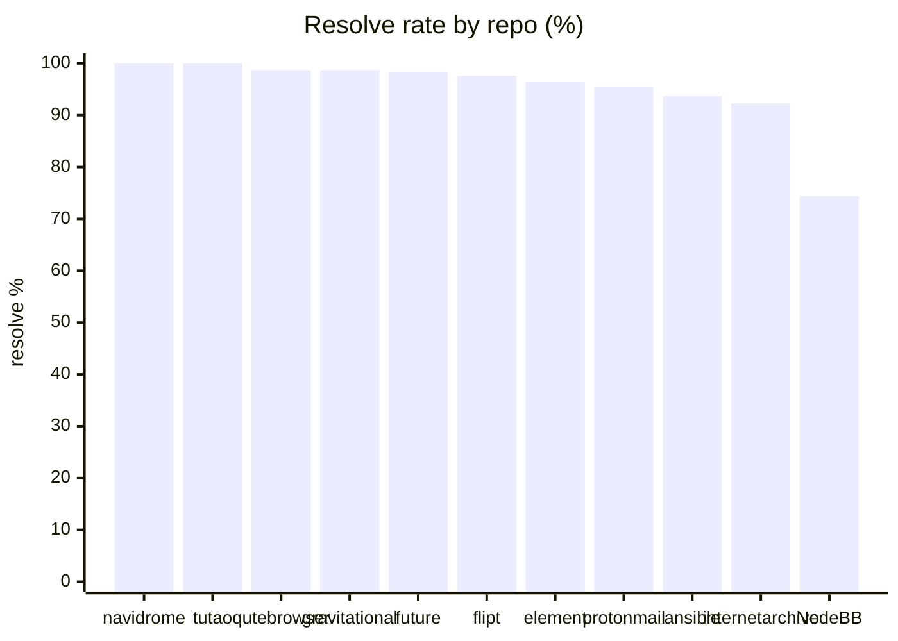
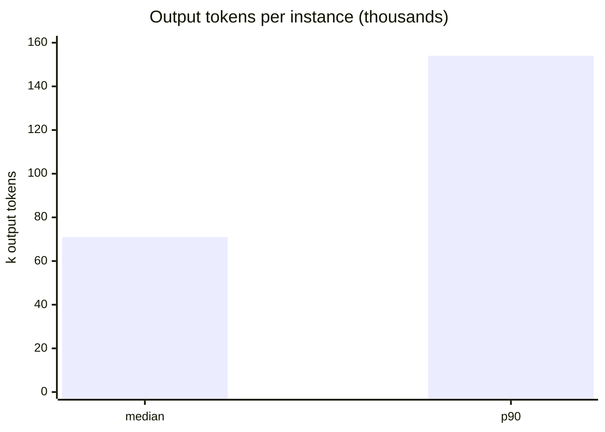
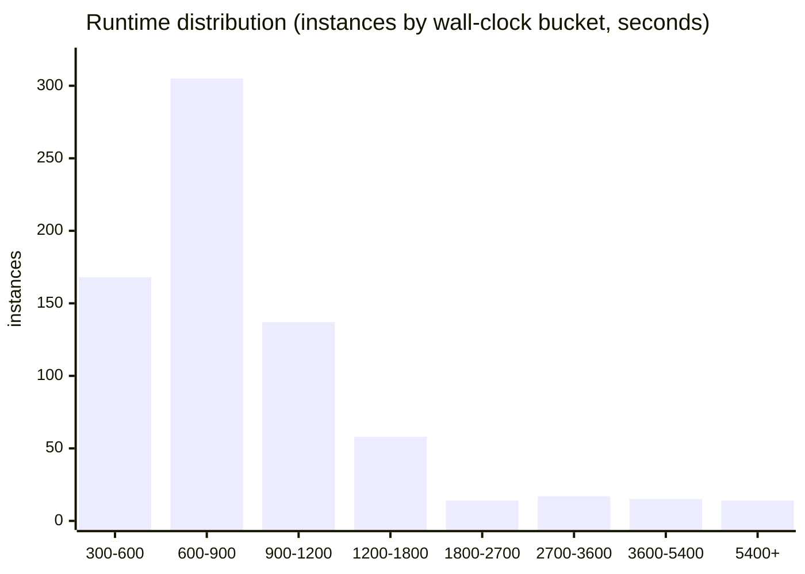

# Scoreboard — good · cheap · fast

SWE-bench Pro, frozen tag `prereg-pro-v1`, whole eligible set in one measurement.

| | metric | value | basis |
|---|---|---|---|
| **GOOD** | resolve rate | **95.33%** | 694 / 728 eligible, official grader |
| **CHEAP** | avg token cost / instance | **~$2.60** | API pricing (Anthropic-comparable per-task cost) |
| **FAST** | wall-clock / instance | **~13 min** | median (p50 770 s) |

> **Read "good" honestly.** 95.33% is on the **public, contaminated** SWE-bench Pro
> split — the *weakest* evidence in this program, not a capability claim (the models
> postdate these repos; see [`OBJECTIONS.md`](OBJECTIONS.md)). **Cheap and fast are
> operational facts** about the run and are not affected by contamination — they are
> the parts of this board that travel.

## Good — resolve rate by repo

| repo | W | L | %win | | repo | W | L | %win |
|---|--:|--:|--:|---|---|--:|--:|--:|
| navidrome | 57 | 0 | 100.0 | | element | 54 | 2 | 96.4 |
| tutao | 20 | 0 | 100.0 | | protonmail | 62 | 3 | 95.4 |
| qutebrowser | 78 | 1 | 98.7 | | ansible | 89 | 6 | 93.7 |
| gravitational | 75 | 1 | 98.7 | | internetarchive | 84 | 7 | 92.3 |
| future | 60 | 1 | 98.4 | | NodeBB | 32 | 11 | 74.4 |
| flipt | 83 | 2 | 97.6 | | **total** | **694** | **34** | **95.33** |

Ten of eleven repos at 92.3%+; NodeBB (74.4%) is the outlier, carrying 11 of the 34
losses. All 34 losses are real graded `not resolved` on non-empty patches — no
empty captures. Full audit incl. development-overlap and independent re-grade:
[`RESULTS.md`](RESULTS.md).

## Cheap — cost & token efficiency

- **Average token cost ~$2.60 / instance at API pricing** — comparable to a
  vendor's advertised per-task cost. Measured, not modeled: the API-mode canary ran
  $2.07/instance on light repos, blended higher across heavy ones. **This is the
  Claude (Sonnet 4.5) leg only** — the GPT-5.5 craft challenger ran on a generous
  codex subscription at ~$0 marginal, so its tokens are not in the $2.60; a
  reproducer paying PAYG for *both* models would pay somewhat more.
- **This run's actual cash: $813.52** in Claude API spend, because most instances
  ran on the operator's **Max $200/mo subscription** at ~$0 marginal — only ~310
  were billed to API (≈ $813.52 / $2.60). The GPT-5.5 challenger was on a separate
  codex subscription ($0 marginal). Plus **~$58 EC2** (~$0.08/instance). So
  out-of-pocket beyond the two subscriptions was ≈ **$870**. See [`RUN_NOTES.md`](RUN_NOTES.md).
- **Token efficiency (per instance, median):** ~137 model turns, ~71k output
  tokens, ~4.7M cache-read tokens (heavy prompt-cache reuse). Totals across the run:
  67M output tokens, 5.3B cache-read.
- **Runnable on a subscription alone.** The cheapest path isn't API at all: with a
  Max 20× ($200/mo) plan, the whole 728-set is reproducible at **zero marginal
  token cost** over ~2 weeks of wall-clock (just the subscription + ~$58 EC2),
  trading time for dollars. The ~$2.60/instance API rate is the *fast* path; the
  subscription is the *cheap* path. (This run used both — mostly subscription, with
  a paid-API tail to finish faster.)

## Fast — runtime & turns

Median **770 s (~13 min)** per instance, p90 **1537 s (~26 min)**; 84% finish in
5–20 min. The right tail is heavy repos and craft-hangs on big suites (max 10,745 s,
a teleport WIN). Model turns: median 137, p90 291; 13.7% exceed SEAL's 250-turn
reference cap.

**"Fast" is per instance, not the campaign.** The full 728-instance run took **~3.5
days** of wall-clock end-to-end — bounded by fleet size (4–8 boxes), three auth
stalls, and quota pauses, not by per-instance speed ([`RUN_NOTES.md`](RUN_NOTES.md)).
The ~13 min is what one instance costs in time; the run is embarrassingly parallel,
so end-to-end is a function of how many boxes you point at it.

| wall-clock | instances | | turns | per instance |
|---|--:|---|---|--:|
| 300–600 s | 168 | | median | 137 |
| 600–900 s | 305 | | mean | 193 |
| 900–1200 s | 137 | | p90 | 291 |
| 1200 s+ | 118 | | max | 2423 |

---

Numbers recompute from `runs/scored/run.jsonl` (verdicts/runtimes) and the committed
trajectory bundle (turns/tokens). Cost is the operator's measured API spend. The
"good" caveat is load-bearing — pair this board with [`OBJECTIONS.md`](OBJECTIONS.md).
