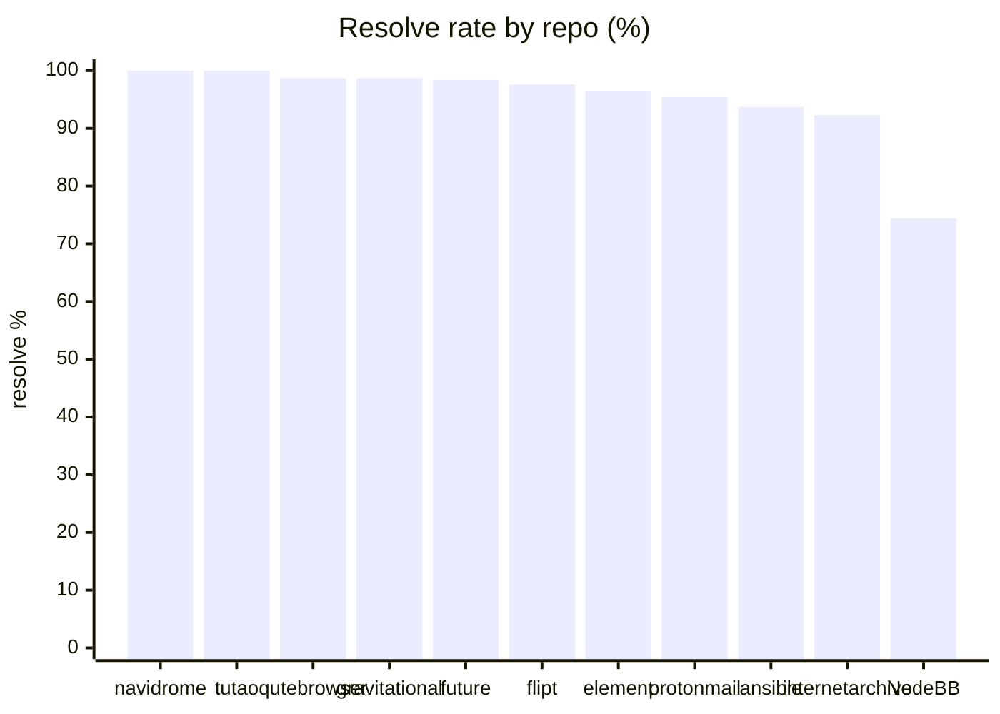
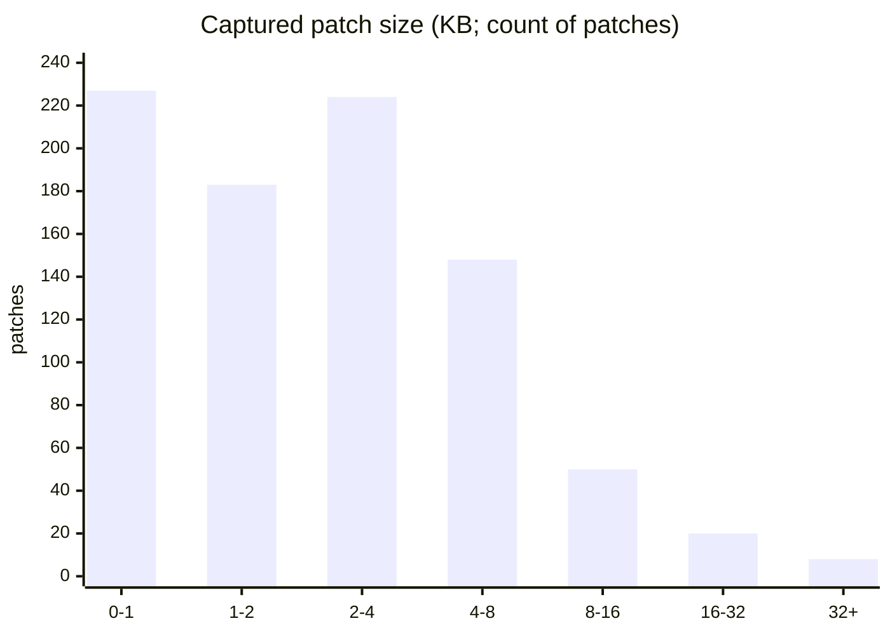
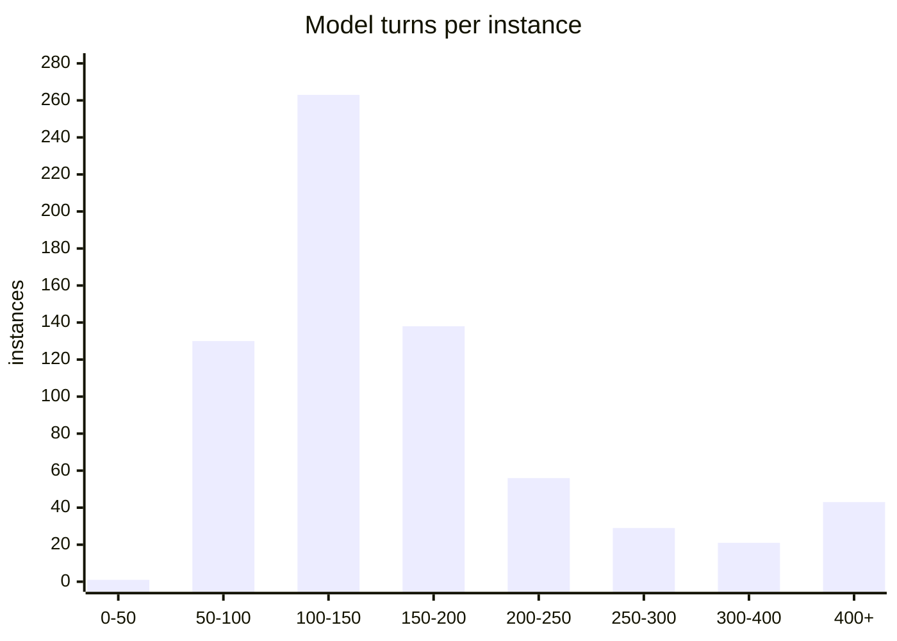
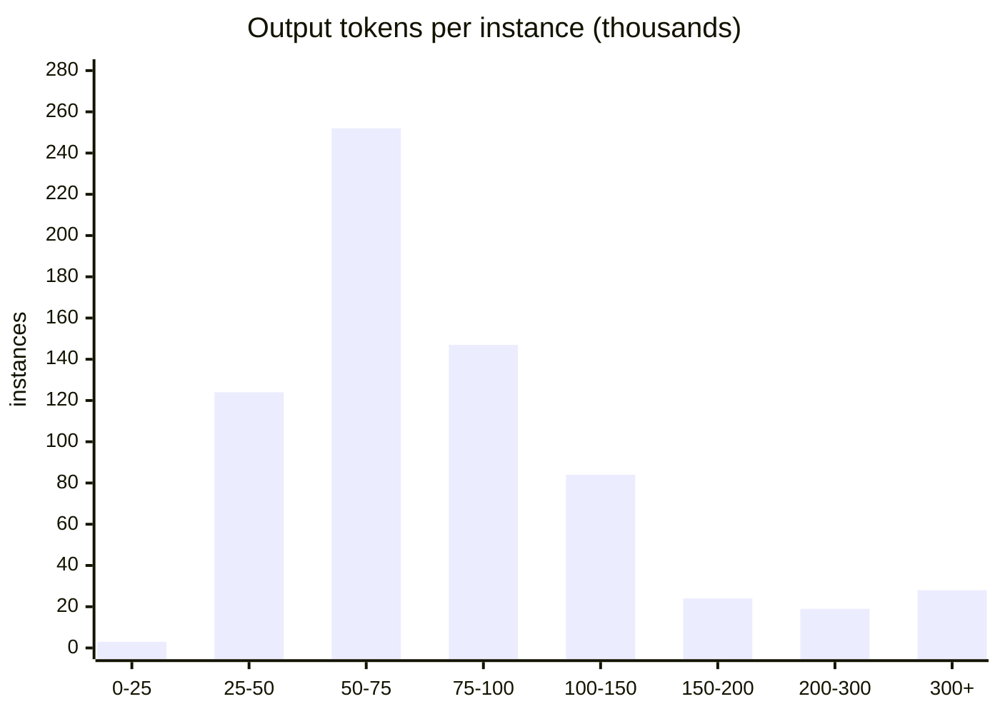
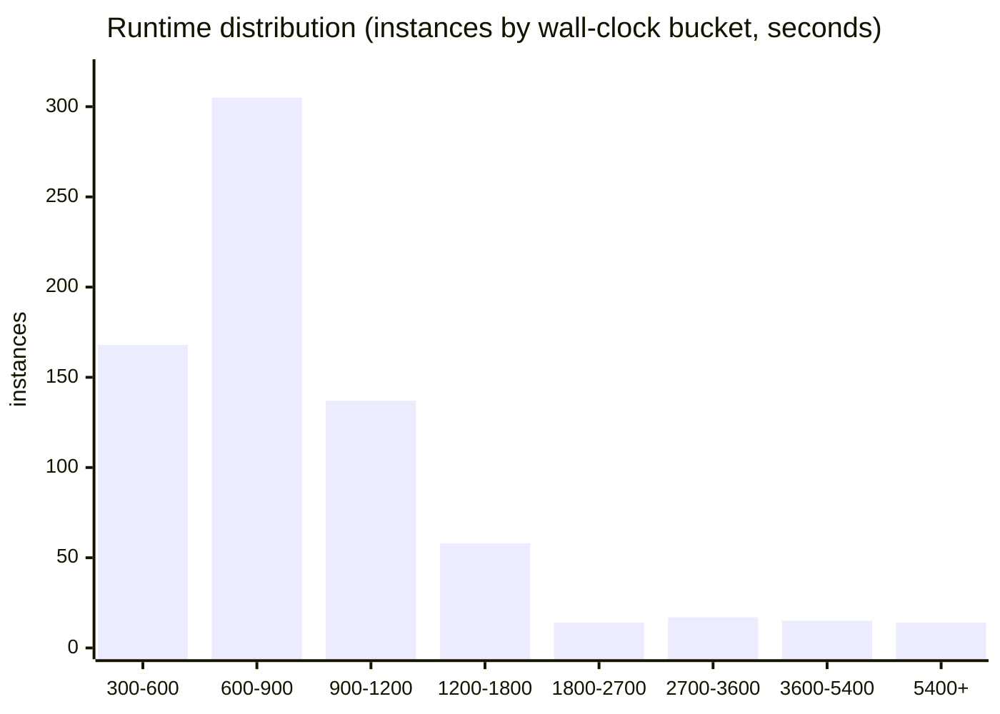

# Scoreboard: result · cost · speed

SWE-bench Pro, whole eligible set (728) in one measurement, run with two model pairs:
the frontier pair (`prereg-pro-v1`) and a pre-registered open-weight ablation
(`prereg-pro-v1-cheap`).

| metric | frontier · Sonnet 4.5 + GPT-5.5 | open-weight · Composer 2.5 + Gemini Flash |
|---|--:|--:|
| **RESULT** — resolve rate | **95.3%** · 694/728 | **93.1%** · 678/728 |
| **COST** — economic $/instance | **~$5.14** | **~$0.41** |
| **SPEED** — median wall-clock | **~12.8 min** | **~8.4 min** |

Same frozen harness, both models swapped; same 728 eligible, **official** grader. The
open-weight pair runs **~12.6× cheaper at 2.2 points lower resolve** — the cleanest single
read on how much the *harness* (not the model tier) carries the result. Cost is *economic*
(public API rates incl. cache; the frontier Claude-leg-only rate is ~$4.73, $5.14 the full
pair) — derivation and the cash-vs-economic split in [`COST_BASIS.md`](COST_BASIS.md). The
per-repo, patch-size, turn, and runtime breakdowns below are the **frontier** run.

> **Don't trust it; verify it.** This is a **public, contamination-prone** split and a
> **system/harness** result, not a model-capability claim. So the repo doesn't ask for
> your trust; it hands you the means to check: reproduce a random sample in one prompt
> ([README](../README.md)). Trust is the one axis an AI can't win against a human; the
> answer is verifiability, not a louder number.

> **Not a leaderboard entry.** The official SWE-bench Pro runs evaluate **models**:
> hold a standard harness fixed, vary the model, rank them. This entry evaluates a
> **harness**: applied methodeutics, a recon→craft→audit inquiry loop. The number measures what the *scaffold*
> contributes, not where a model ranks; not a leaderboard submission, and not "our
> model beats X" (see [`OBJECTIONS.md`](OBJECTIONS.md)).

> **The bar is the vibe coder.** A harness worth building **resolves more, costs less,
> and finishes faster** than a human handed the same task; that's why this board is a
> triple rather than a single score. The one axis it *can't* beat the human on is **trust**;
> reproduce-it-yourself is how it competes there anyway.

## Result: resolve rate by repo

| repo | W | L | %win | | repo | W | L | %win |
|---|--:|--:|--:|---|---|--:|--:|--:|
| navidrome | 57 | 0 | 100.0 | | element | 54 | 2 | 96.4 |
| tutao | 20 | 0 | 100.0 | | protonmail | 62 | 3 | 95.4 |
| qutebrowser | 78 | 1 | 98.7 | | ansible | 89 | 6 | 93.7 |
| gravitational | 75 | 1 | 98.7 | | internetarchive | 84 | 7 | 92.3 |
| future | 60 | 1 | 98.4 | | NodeBB | 32 | 11 | 74.4 |
| flipt | 83 | 2 | 97.6 | | **total** | **694** | **34** | **95.3** |

Ten of eleven repos at 92.3%+; NodeBB (74.4%) is the outlier, carrying 11 of the 34
losses. All 34 losses are real graded `not resolved` on non-empty patches, no
empty captures. Full audit incl. development-overlap and independent re-grade:
[`RESULTS.md`](RESULTS.md).

**Patch sizes: small and surgical.** Across all 860 captured diffs: median **2.1
KB**, p90 7.6 KB, max 190 KB. These are targeted source fixes, not sprawling
rewrites, the kind of change a maintainer can actually review.

## Cost & token efficiency

- **Average token cost ~$4.73 / instance**, the **Claude (Sonnet 4.5) leg** with all
  728 instances priced at public API rates including cache. The GPT-5.5 craft
  challenger adds ~$0.42/instance, so the full frontier pair is **~$5.14/instance**.
  Every line of this is derived from the committed token totals in
  [`COST_BASIS.md`](COST_BASIS.md); it supersedes the earlier ~$2.60 cash-per-billed
  figure, which conflated the cash and economic bases.
- **This run's actual cash: $813.52** in Claude API spend, because most instances
  ran on the operator's **Max $200/mo subscription** at ~$0 marginal; only ~310
  were billed to API. The GPT-5.5 challenger was on a separate codex subscription
  ($0 marginal). Plus **~$58 EC2** (~$0.08/instance). So out-of-pocket beyond the
  two subscriptions was ≈ **$870**. Cash and economic are different bases; the
  reconciliation is in [`COST_BASIS.md`](COST_BASIS.md#cash-vs-economic) and [`RUN_NOTES.md`](RUN_NOTES.md).
- **Token efficiency (per instance, median):** ~137 model turns, ~71k output
  tokens, ~4.7M cache-read tokens (heavy prompt-cache reuse). Totals across the run:
  67M output tokens, 5.3B cache-read.
- **Runnable on a subscription alone.** The cheapest path isn't API at all: with a
  Max 20× ($200/mo) plan, the whole 728-set is reproducible at **zero marginal
  token cost** over ~2 weeks of wall-clock (just the subscription + ~$58 EC2),
  trading time for dollars. The ~$4.73/instance API rate is the *quick* path; the
  subscription is the *low-cost* path. (This run used both, mostly subscription, with
  a paid-API tail to finish faster.)

**Model turns per instance** (recon + craft + audit, all retries; count of instances):

93 instances (13.7%) exceed SEAL's 250-turn reference cap: the last three bins.

**Output tokens per instance** (count of instances):

| | turns | output tok | | | turns | output tok |
|---|--:|--:|---|---|--:|--:|
| median | 137 | 71k | | p90 | 291 | 154k |
| mean | 193 | 99k | | max | 2,423 | n/a |

## Speed: runtime & turns

Median **770 s (~13 min)** per instance, p90 **1537 s (~26 min)**; 84% finish in
5–20 min. The right tail is heavy repos and craft-hangs on big suites (max 10,745 s,
a teleport WIN). Model turns: median 137, p90 291; 13.7% exceed SEAL's 250-turn
reference cap.

**Per-instance, not the campaign.** The full 728-instance run took **~3.5
days** of wall-clock end-to-end, bounded by fleet size (4–8 boxes), three auth
stalls, and quota pauses, not by per-instance speed ([`RUN_NOTES.md`](RUN_NOTES.md)).
The ~13 min is what one instance costs in time; the run is embarrassingly parallel,
so end-to-end is a function of how many boxes you point at it.

| wall-clock | instances | | turns | per instance |
|---|--:|---|---|--:|
| 300–600 s | 168 | | median | 137 |
| 600–900 s | 305 | | mean | 193 |
| 900–1200 s | 137 | | p90 | 291 |
| 1200 s+ | 118 | | max | 2423 |

---

Numbers recompute from `runs/scored/run.jsonl` (verdicts/runtimes) and the committed
trajectory bundle (turns/tokens). Cost is the operator's measured API spend. The
contamination caveat is load-bearing; pair this board with [`OBJECTIONS.md`](OBJECTIONS.md).
